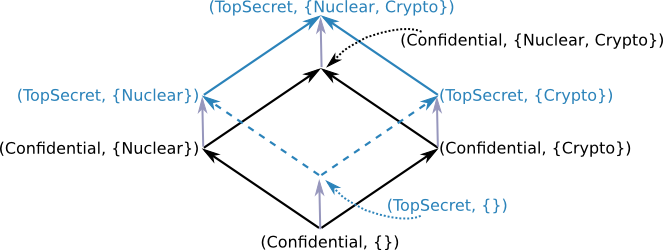

% Intro to LIO
% Amit Levy and Deian Stefan
%

# Labels

* Labels are points on a lattice with
  well defined $\sqsubseteq$, $\sqcap$, and $\sqcup$:

    ~~~~ {.haskell}
    class (Eq l, Show l) => Label l where
        -- Relation that dictates how information flows
        canFlowTo :: l -> l -> Bool
        -- Least upper bound
        lub :: l -> l -> l
        -- Greatest lower bound
        glb :: l -> l -> l
    ~~~~

* Example label:

    ~~~~ {.haskell}
    data SimpleLabel = Public | Classified | TopSecret deriving (Eq, Ord, Show)
    
    instance Label SimpleLabel where
      x `canFlowTo` y = x <= y
      lub = max
      glb = min
    ~~~~

    ~~~~
    *Main> [ Public `canFlowTo` TopSecret, TopSecret `canFlowTo` Public ]
    [True,False]
    *Main> [ Public `lub` TopSecret, Classified `glb` TopSecret ]
    [TopSecret,Classified]
    ~~~~

# Extending SimpleLabel

* This is called a _total-order_: for every label $L_1$ and $L_2$,
  either $L_1 \sqsubseteq L_2$ or $L_2 \sqsubseteq L_1$

* Extend `SimpleLabel` with compartment:

    ~~~~ {.haskell}
    import Data.Set (Set)

    data Compartment = Nuclear | Crypto deriving (Eq, Ord, Show)

    data MilLabel = MilLabel { sensitivity  :: SimpleLabel
                             , compartments :: Set Compartment
                             } deriving (Eq, Show)
    ~~~~

# Exercise: define the `Label` instance

* Is this lattice a total order?

    * No! Consider `(TopSecret, Crypto)` and `(TopSecret, Nuclear)`

* Examples of use:

~~~
*Main> let set x = Data.Set.fromList x
*Main> MilLabel Public (set [Nuclear]) `canFlowTo`
       MilLabel TopSecret (set [Nuclear, Crypto])
True
*Main> MilLabel Public (set [Nuclear]) `canFlowTo` 
       MilLabel Classified (set [Crypto])
False
*Main> MilLabel Classified (set [Crypto]) `canFlowTo`
       MilLabel Public (set [Nuclear])
False
*Main> MilLabel Classified (set [Crypto]) `glb` MilLabel Public (set [Nuclear])
MilLabel {sensitivity = Public, compartments = fromList []}
~~~

* Hint: Start by expressing the lattice properties using set theory

* Use library `Data.Set` vs. set as lists

    ~~~~ {.haskell}
    import Data.Set (Set)
    import qualified Data.Set as Set
    ~~~~

# Answer

* Defining the lattice properties using set theory:

    * Can flow to: $(L_1,C_1) \sqsubseteq (L_2, C_2)$ if $L_1 \sqsubseteq L_2$ and $C_1 \subseteq C_2$
    * Least upper bound: $(L_1,C_1) \sqcup (L_2, C_2) \equiv (L_1 \sqcup L_2, C_1 \cup C_2)$
    * Greatest lower bound: $(L_1,C_1) \sqcap (L_2, C_2) \equiv (L_1 \sqcap L_2, C_1 \cap C_2)$

* Simple translation to Haskell:

    ~~~~ {.haskell}
    instance Label MilLabel where
      (MilLabel s1 c1) `lub` (MilLabel s2 c2) =
        MilLabel (s1 `lub` s2) (c1 `Set.union` c2)

      (MilLabel s1 c1) `glb` (MilLabel s2 c2) =
        MilLabel (s1 `glb` s2) (c1 `Set.intersection` c2)

      (MilLabel s1 c1) `canFlowTo` (MilLabel s2 c2) =
        (s1 `canFlowTo` s2) && (c1 `Set.isSubsetOf` c2)
    ~~~~

* Why you shouldn't use lists?
    * Slow, bug prone: need to reduce to set (even for constructor),  etc.

# LIO privileges

* Define privileges as any type with $\sqsubseteq_p$ for a given label type

* How do we define $L_1 \sqsubseteq_p L_2$?

    1. Use $p$ to downgrade $L_1$ to the lowest possible point in lattice $L_1'$

    2. Check $L_1' \sqsubseteq_p L_2$

* Privileges for `MilLabel`:

    ~~~~ {.haskell}
    data MilPriv = MilPriv SimpleLabel (Set Compartment)
    ~~~~

    * The first argument dictates how to downgrade sensitivity. 

    * The second argument dictates how compartments are removed.

    * E.g., Privilege `TopSecret`@{`Crypto`,`Nuclear`} can declassify
      anything.

# Exercise

* Define `downgrade`

    ~~~~ {.haskell}
    downgrade (MilPriv sp cp) (MilLabel s0 c0) =  ???
    ~~~~

* Example use

    ~~~~
    *Main> downgrade (MilPriv TopSecret (set []))
                     (MilLabel TopSecret (set []))
    MilLabel {sensitivity = Public, compartments = fromList []}
    *Main> downgrade (MilPriv TopSecret (set []))
                     (MilLabel Classified (set [Crypto]))
    MilLabel {sensitivity = Public, compartments = fromList [Crypto]}
    *Main> downgrade (MilPriv TopSecret (set [Crypto, Nuclear]))
                     (MilLabel TopSecret (set [Crypto]))
    MilLabel {sensitivity = Public, compartments = fromList []}
    *Main> downgrade (MilPriv TopSecret (set [Crypto, Nuclear]))
                     (MilLabel Classified (set [Crypto]))
    MilLabel {sensitivity = Public, compartments = fromList []}
    ~~~~

# Answer: 

~~~~ {.haskell}
downgrade (MilPriv sp cp) (MilLabel s0 c0) = 
    let s1 = if sp >= s0
               then Public else s0
        c1 = c0 `Set.difference` cp
    in MilLabel s1 c1
~~~~

# Let's define $\sqsubseteq_p$ class

* Privileges are types that are instances of the `PrivDesc` class

    ~~~~ {.haskell}
    class Label l => PrivDesc l p where
      canFlowToPrivDesc :: p -> l -> l -> Bool
      partDowngradePrivDesc :: p -> l -> l -> l
    ~~~~

* `canFlowToPrivDesc` implements $\sqsubseteq_p$

* `partDowngradePrivDesc priv lcur lgoal`
   
     * Downgrade `lcur` as close to `lgoal` as possible using `priv`
     
     * We'll see where this is used later!

* Define instance for `MilLabel` and `MilPriv`

    ~~~~ {.haskell}
    instance PrivDesc MilLabel MilPriv where
      canFlowToPrivDesc p l1 l2 = downgrade p l1 `canFlowTo` l2
      partDowngradePrivDesc p l1 l2 = downgrade p l1 `lub` l2
    ~~~~
    

# Example use

~~~
*Main> canFlowToPrivDesc (MilPriv TopSecret (set []))
                         (MilLabel TopSecret (set []))
                         (MilLabel Public (set []))
True
*Main> canFlowToPrivDesc (MilPriv TopSecret (set []))
                         (MilLabel Classified (set [Crypto]))
                         (MilLabel Public (set []))
False
*Main> canFlowToPrivDesc (MilPriv TopSecret (set [Crypto, Nuclear]))
                         (MilLabel TopSecret (set [Crypto]))
                         (MilLabel Public (set []))
True
~~~

# Controlling privilege creation

* Really, `PrivDesc` instance _describes_ privileges, but doesn't
  confer any

    * Need to prevent malicious code from synthesizing privileges!

* Internally, LIO privileged functions expect `Priv` types:

    ~~~~ {.haskell}
    -- Can we allocate object with label l?
    guardAllocP :: PrivDesc l p => Priv p -> l -> LIO l ()
    guardAllocP p l = do
      ...
      unless (canFlowToP p ...) $! throwLIO CurrentLabelViolation
      ...

    -- Wrapper that uses actual privileges
    canFlowToP :: PrivDesc l p => Priv p -> l -> l -> Bool
    canFlowToP priv = canFlowToPrivDesc (privDesc priv)
    ~~~~

* So, wrap `PrivDesc` in `Priv` and they give you power:

    ~~~~ {.haskell}
    newtype Priv a = PrivTCB a deriving (Show, Eq, Typeable)
    ~~~~

    * Use Safe Haskell to ensure only trusted code sees `PrivTCB` constructor

# Using labels in Haskell

~~~~ {.haskell}
instance (Label l) => Monad (LIO l) where ...
~~~~

* Introduce new _labeled IO_ monad `LIO`.  Like `RIO`, except:
    * Also keeps track of thread's _current label_ and _current clearance_

* Represent labeled pure values with type wrapper

    ~~~~ {.haskell}
    data Labeled l t = LabeledTCB l t
    ~~~~

* Can label and unlabel values within `LIO` monad:

    ~~~~ {.haskell}
    label :: Label l => l -> a -> LIO l (Labeled l a)
    unlabel :: (Label l) => Labeled l a -> LIO l a
    unlabelP :: Priv l p => p -> Labeled l a -> LIO l a
    ~~~~

    * `label` requires value label to be between current label & clearance
    * `unlabel` raises current label to:  old current label $\sqcap$ value label
    * `unlabelP` uses privileges to raise label less

# DC Labels

* We would ideally like $L_\emptyset$ to be in middle of lattice
* Define labels as consisting of **2** components
  $L = \langle$Secrecy `%%` Integrity$\rangle$
* Label components & privileges are boolean formulas over *principals*
    * Represent as minimal formulas in CNF, without negation
    * Makes labels unique, operations decidable
* $\langle S_1$ `%%` $I_1\rangle\sqsubseteq_p
  \ \langle S_2$ `%%` $I_2\rangle$
  iff
    * $S_2 \wedge p \Longrightarrow S_1$, and
    * $I_1 \wedge p \Longrightarrow I_2$ (note reversed order)
* Means you need privileges to weaken S, or to add to I
    * $p=$`True` means no privileges, $p=$`"David"` means some privileges
    * $p=$`False` would confer all privileges
* Note disjunctive clauses in CNF formulas called
    _categories_

# What is a principal?

* Principals are just strings
    * E.g., might correspond to users or web sites

* Also have pseudo-principals starting with `#`
    * By convention, system never grants privileges starting `#`
    * Pseudo-principals let you subdivide privileges
    * Example: $\texttt{dm}\vee\texttt{#friends}$
      ($\texttt{dm}\Longrightarrow\texttt{dm}\vee\texttt{#friends}$,
      but not vice versa)

# Clearance and DC labels

* Convenient to have different default $L_\mathrm{cur}$ and $C_\mathrm{cur}$
* Set default label $L_\mathrm{def} = L_\emptyset = \langle\emptyset$ 
  `%%` $\emptyset\rangle = \langle$True `%%` True$\rangle$
* Set default clearance to $C_\mathrm{def} =\langle$`#clearance %%` True$\rangle$
* Example policy: Everyone can read, only I can export
    * Say my privileges are $p=$`dm`
    * Label object with $L = \langle S$ `%%` True$\rangle$
     where $S = $`dm` $\vee$ `#clearance`$\rangle$

    * $p\Longrightarrow S$, so $L\sqsubseteq_p L_\emptyset$ and I can
      export data

    * Also $S\Longrightarrow$ `#clearance`, so $L\sqsubseteq
      C_\mathrm{def}$--i.e., others can taint themselves to read data,
      but not export it

# What is the LIO Monad?

* Remember the RIO Monad?

    ~~~~ {.haskell}
    newtype RIO a = UnsafeRIO (IO a)
    ~~~~

* RIO statically restricts which actions can be performed (e.g. can only open
  files that match a fixed pattern)

* LIO is similar, but instead carries information about what kinds of actions
  a thread can perform.

    ~~~~ {.haskell}
    data LIOState l = LIOState { lioCurrentLabel :: l, lioClearance :: l }
    newtype LIO l a = UnsafeLIO { unLIO :: IORef (LIOState l) -> IO a }

    instance Monad (LIO l)
    ~~~~

    * Decisions about which side effects to allow are made dynamically

# Current Label

~~~~ {.haskell}
getLabel :: Label l => LIO l l
~~~~

* Represents the label of executing thread at a point in time

* Restricts which data we can read and what side-effects we can perform

    * Can write if current label `canFlowTo` target's label

    * Can read if target's label `canFlowTo` current label

* Certain operations (e.g. `unlabel`) change the current label

    * For example, to read a `Labeled` value with a high label, I must raise
      my current label.

# Current Label - Example

~~~~ {.haskell}
nickname :: Labeled DCLabel String
nickname = LabeledTCB (True %% True) "dm"

emailAddress :: Labeled DCLabel String
emailAddress = LabeledTCB ("dm" \/ "amit" \/ "deian" %% True)
                "mazieres-smeisvhac56hquuvuqdggqe@nospam.scs.stanford.edu"

personalEmail :: Labeled DCLabel String
personalEmail = LabeledTCB ("dm" %% True) "dm@scs.stanford.edu"
~~~~

* Say we start running with public current label (True %% True). What's the
  current label after performing the following operations?

    ~~~~ {.haskell}
    unlabel nickname
    ~~~~

> - (True %% True)

# Current Label - Example

~~~~ {.haskell}
nickname :: Labeled DCLabel String
nickname = LabeledTCB (True %% True) "dm"

emailAddress :: Labeled DCLabel String
emailAddress = LabeledTCB ("dm" \/ "amit" \/ "deian" %% True)
                "mazieres-smeisvhac56hquuvuqdggqe@nospam.scs.stanford.edu"

personalEmail :: Labeled DCLabel String
personalEmail = LabeledTCB ("dm" %% True) "dm@scs.stanford.edu"
~~~~

* Say we start running with public current label (True %% True). What's the
  current label after performing the following operations?

    ~~~~ {.haskell}
    unlabel email
    ~~~~

> - ("dm" $\vee$ "amit" $\vee$ "deian" %% True)

# Current Label - Example

~~~~ {.haskell}
nickname :: Labeled DCLabel String
nickname = LabeledTCB (True %% True) "dm"

emailAddress :: Labeled DCLabel String
emailAddress = LabeledTCB ("dm" \/ "amit" \/ "deian" %% True)
                "mazieres-smeisvhac56hquuvuqdggqe@nospam.scs.stanford.edu"

personalEmail :: Labeled DCLabel String
personalEmail = LabeledTCB ("dm" %% True) "dm@scs.stanford.edu"
~~~~

* Say we start running with public current label (True %% True). What's the
  current label after performing the following operations?

    ~~~~ {.haskell}
    -- current label is ("dm" \/ "amit" \/ "deian" %% True)
    unlabel personalEmail
    ~~~~

> - ("dm" $\wedge$ "dm" $\vee$ "amit" $\vee$ "deian" %% True)

> - ("dm" %% True)

# Current Label - Bonus Round!

~~~~ {.haskell}
personalEmail :: Labeled DCLabel String
personalEmail = LabeledTCB ("dm" %% True) "dm@scs.stanford.edu"

dmPriv :: DCPriv
dmPriv = PrivTCB $ toComponent "dm"
~~~~

* Say we start running with public current label (True %% True). What's the
  current label after performing the following operations?

    ~~~~ {.haskell}
    -- current label is (True %% True)
    unlabelP dmPriv personalEmail
    ~~~~

> - In last example was: ("dm" %% True)

> - Because of privileges: (True %% True)

# Clearance

~~~~ {.haskell}
getClearance :: Label l => LIO l l
~~~~

* Limits how high the current label can get

    * Both writes and reads must be below the clearance

* Allows "need-to-know" policies

    * Restricts the power of covert channels

* Can lower clearance to label, but raising requires privileges

# `Labeled` Values under the hood

* `Labeled` values respect the current labal and clearance of a thread:

    ~~~~ {.haskell}
    data Labeled l a = LabeledTCB l a

    label :: Label l => l -> v -> LIO l (Labeled l v)
    label l a = guardAlloc >> return $ LabeledTCB l v
      where guardAlloc = do
              currentLabel <- getLabel
              clearance <- getClearance
              unless (canFlowTo currentLabel l) $! throwLIO CurrentLabelViolation
              unless (canFlowTo l clearance) $! throwLIO ClearanceViolation

    unlabel :: Label l => Labeled l v -> LIO l v
    unlabel (LabeledTCB l v) = taint >> return v
      where taint = do
              currentLabel <- getLabel
              clearance <- getClearance
              unless (canFlowTo l clearance) $! throwLIO ClearanceViolation
              setLabelTCB (l `lub` currentLabel)
    ~~~~

# Concurrency - [`LMVar`s][`LMVar`]

  * Labeled version of `MVar`s with fixed label

    ~~~~ {.haskell}
    module LIO.Concurrent.LMVar

    data LMVar l v = LMVarTCB l (MVar v)

    newEmptyLMVar :: l -> LIO l (LMVar l a)

    putLMVar :: Label l => LMVar l v -> -> v -> LIO l ()
    putLMVar (LMVarTCB l mvar) v = guardWrite l >> ioTCB $ IO.putMVar mvar v

    takeLMVar :: Label l => LMVar l v -> LIO l v
    takeLMVar (LMVar l mvar) = guardWrite l >> ioTCB $ IO.takeMVar mvar

    guardWrite :: Label l => l LIO l ()
    guardWrite l = do
      taint l
      currentLabel <- getLabel
      clearance <- getClearance
      unless (canFlowTo currentLabel lref) $! throwLIO CurrentLabelViolation
      unless (canFlowTo lref clearance) $! throwLIO ClearanceViolation
    ~~~~

# Concurrency - Threads

~~~~ {.haskell}
module LIO.Concurrent
forkLIO :: LIO l () -> LIO l ()
~~~~

* Can use threads to compute things at different labels  
  (e.g., interact with multiple web sites before combining the data)

* `LMVars` used to synchronize and share data between threads

    ~~~~ {.haskell}
    liomain :: LIO DCLabel ()
    liomain = do
      secretVar <- newEmptyLMVar ("alice" %% True)
      forkLIO $ do
        taint $ "alice" %% True
        putLMVar secretVar "Please do not share"

      forkLIO $ do
        taint $ "bob" %% True
        logP bobPriv "I'll wait for a message from Alice"
        secret <- takeLMVar passwordVar
        logP bobPriv password -- This will fail!
    ~~~~

# Miscellany

* Remeber privileges?

    ~~~~ {.haskell}
    labelP :: PrivDesc l p => Priv p -> a -> LIO l (Labeled a)
    ulabelP :: PrivDesc l p => Priv p -> Labeled a -> LIO l a
    putMVarP :: PrivDesc l p => Priv p -> LMVar l a -> a -> LIO l ()
    takeLMVarP :: PrivDesc l p => Priv p -> LMVar l a -> LIO l a
    ~~~~

    * Haskell's abstractions at work - curry privilege into first argument of
      function

* [`LIORef`s][`LIORef`] - labeled, mutable values

    ~~~~ {.haskell}
    data LIORef l a
    newLIORefP :: PrivDesc l p => Priv p -> l -> a -> LIO l (LIORef l a)
    readLIORefP :: PrivDesc l p => Priv p -> LIORef l a -> LIO l a
    writeLIORefP :: PrivDesc l p => Priv p -> LIORef l a -> a -> LIO l ()
    ~~~~

* [`LObj`][`LObj`] - associates an IO object with a label

    * Can use `blessTCB` to turn an `IO` action into an `LIO` action.
      `guardWrite` on the `LObj`'s label

    ~~~~ {.haskell}
    blessTCB :: Label l => (a -> IO b) -> LObj l a -> LIO l b 
    ~~~~

# Defining labeled objects

~~~ {.haskell}
{-# LANGUAGE Trustworthy #-}

module ToyLIO where
import safe qualified System.IO as IO
import safe LIO
import safe LIO.DCLabel
import LIO.TCB.LObj

type Handle = LObj DCLabel IO.Handle

hPutStrLnP :: DCPriv -> Handle -> String -> LIO DCLabel ()
hPutStrLnP = blessPTCB IO.hPutStrLn

hPutStrLn :: Handle -> String -> LIO DCLabel ()
hPutStrLn = blessTCB IO.hPutStrLn

stdout :: Handle
stdout = LObjTCB (True %% True) IO.stdout

myPriv :: DCPriv
myPriv = PrivTCB (True %% True)

test = evalDC $ hPutStrLnP myPriv stdin "Hello world"
~~~

# Main exercise: LIO multi-player game

* `NetLib.hs` -- trusted (labeled) network library

    *`{-# LANGUAGE Trustworthy #-}`

* `liorock.hs` -- main 

* Probably also:

    * `Common.hs` -- `{-# LANGUAGE Safe #-}` (`Move`, `outcome`, etc.)

    * `Play.hs` -- `{-# LANGUAGE Safe #-}`

* Goal: Make it impossible for third-party translations of game (that
  substitute alternate `Play.hs`) to cheat

[`LIORef`]: http://hackage.haskell.org/packages/archive/lio/latest/doc/html/LIO-LIORef.html
[`LMVar`]: http://hackage.haskell.org/packages/archive/lio/latest/doc/html/LIO-Concurrent-LMVar.html
[`LObj`]: http://hackage.haskell.org/packages/archive/lio/latest/doc/html/LIO-TCB-LObj.html
